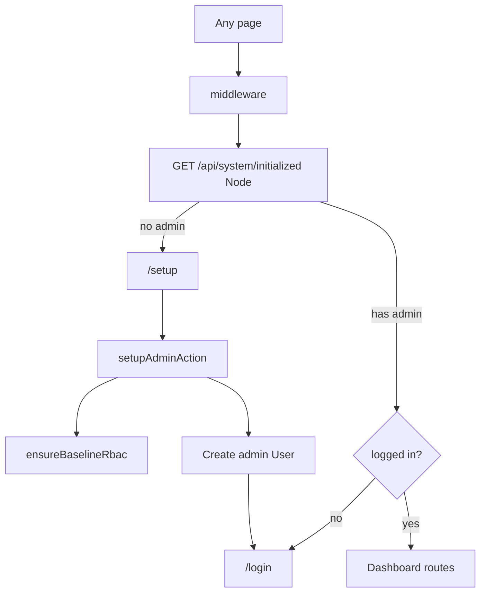

# Agent handoff — tCrm

**Last updated: May 2026**

Canonical catch-up document for agents continuing work on this monorepo. Read this before [ARCHITECTURE.md](./ARCHITECTURE.md) when you need **current status**; architecture doc has stable design patterns but outdated phase labels.

**Prior session context:** Edge middleware fixes, first-run `/setup`, suppliers, internal SKU — see agent transcript `9c1549ca-9649-478f-8413-0a8d09d7158b`.

---

## 1. Project snapshot

| Item | Detail |
|------|--------|
| **App** | `apps/crm` (`@crm/app`) — Next.js 16 App Router |
| **Packages** | `@crm/auth`, `@crm/db`, `@crm/lib`, `@crm/ui`, `@crm/core` |
| **Stack** | React 19, TypeScript strict, Tailwind v4, shadcn New York+zinc, MongoDB/Mongoose, Auth.js v5, Turborepo/pnpm |
| **Design** | [design.md](./design.md), [rules.md](./rules.md) |
| **Last commit** | `e241fe6` — `feat: add first-run setup, suppliers, internal sku` |

### Uncommitted work (not in `e241fe6`)

~18 files, +191 / −83 lines. Review before Phase 2:

| Area | Files | Summary |
|------|-------|---------|
| **Middleware** | `apps/crm/src/middleware.ts` | Custom Edge middleware: `getToken` from `next-auth/jwt`, setup redirect via `/api/system/initialized` — no Mongoose on Edge |
| **Env loading** | `apps/crm/next.config.ts` | `loadEnvConfig` for repo root then `apps/crm` (`.env.local` wins) |
| **Setup / register** | `setup/actions.ts`, `register/actions.ts` | `ensureBaselineRbac()` so seed is optional for roles |
| **Auth package** | `auth-instance.ts`, `config.ts`, `package.json` | Split edge `authorized` into `auth.config.ts`; main instance merges configs |
| **DB seed** | `packages/db/src/seed.ts` | Exported `ensureBaselineRbac()` (permissions + roles only) |
| **Lib** | `packages/lib/src/env.ts` | `isPublicRegistrationEnabled()` for gated `/register` |
| **Login UX** | `login/actions.ts`, `login-form.tsx`, `page.tsx` | Minor login flow tweaks |
| **Config** | `.env.example` | `ALLOW_PUBLIC_REGISTRATION` documented |

**Recommendation:** commit or squash these fixes before starting Phase 2 so logistics work builds on a stable baseline.

---

## 2. Phase status matrix

| Phase | Planned scope | Status |
|-------|---------------|--------|
| **0** | Auth shell, dynamic RBAC, admin permissions UI, dashboard | **Done** |
| **1** | Inventory schema, Alutent Excel, DataTable, warehouses | **Mostly done** |
| **1 preflight** | `/setup`, Supplier model, internal SKU, import binding | **Done** in `e241fe6`; polish remains |
| **2** | Logistics, offers, builds; `apps/landing` (tWeb fork) | **Not started** — no `apps/landing` |
| **3** | Accounting, multi-tenant SaaS, reporting | **Not started** |

**Doc drift:** [README.md](../README.md) and [.cursor/rules/general.mdc](../.cursor/rules/general.mdc) still say “Phase 0 (current)”. [ARCHITECTURE.md](./ARCHITECTURE.md) §4 says “Phase 0 — active”. Update those labels in a small follow-up; **this file is the living status source.**

---

## 3. Phase 0 — what exists

- **Routes:** `/login`, `/register` (gated by `ALLOW_PUBLIC_REGISTRATION`), `/` dashboard, `/admin/permissions`
- **Layouts:** `requireAuth()` / `requirePermission(key)` → `notFound()` when denied
- **Auth:** Single NextAuth instance — `packages/auth/src/auth-instance.ts` (Node API routes + server session)
- **Session:** JWT, 8h max age; `user.id` + `user.permissions[]` on session
- **RBAC:** `Permission`, `Role`, `User` models; effective permissions = role union + direct keys
- **Seed:** `pnpm --filter @crm/db seed` — permissions, roles, optional admin user, warehouses

---

## 4. Phase 1 — what exists

Full inventory reference: [inventory.md](./inventory.md). Preflight additions below.

### Data models (`packages/db/src/models/`)

| Model | Notes |
|-------|--------|
| **Product** | `sku` (manufacturer/import, unique), `internalSku` (sparse unique), `supplierId`, `supplierSku`, BOM `components[]`, GridFS `imageIds`, i18n names/descriptions/colors, pricing |
| **Category** | 3-level tree (`level`, `parentId`, `slug`); `skuPrefix`, `skuTotalLength`, `skuPadChar`; `supplierId` |
| **Supplier** | Company/contact fields |
| **Warehouse** | Baseline keys: `kispest`, `erzsebet`, `recsei` |
| **StockLevel** | Unique `(productId, warehouseId)` |
| **StockAdjustment** | Audit log (reason, delta, user, timestamp) |

### Core (`packages/core/src/inventory/`)

- `parseInventoryXlsx` / `commitInventoryImport` / `exportInventoryXlsx`
- `generateInternalSku` — `packages/core/src/inventory/sku.ts`
- Column map: `ALUTENT_COLUMNS` / `excel-columns.ts`

### CRM routes

| Route | Purpose |
|-------|---------|
| `/inventory` | Product list (DataTable) |
| `/inventory/[sku]` | Detail (shows internal SKU) |
| `/inventory/new` | Create product |
| `/inventory/import` | Alutent Excel preview + commit |
| `/inventory/export` | Download `.xlsx` |
| `/inventory/categories` | **View-only** category list |
| `/admin/warehouses` | Warehouse CRUD |
| `/api/uploads`, `/api/uploads/[id]` | GridFS uploads |

### Import binding (preflight)

Import form requires **text** inputs (not dropdowns yet):

- `supplierKey` — lookup `Supplier` by key
- `categorySlug` — target category for generated `internalSku`

See `apps/crm/src/app/(dashboard)/inventory/import/upload-form.tsx`.

### Seed extras (`packages/db/src/seed-cli.ts`)

| Env flag | Effect |
|----------|--------|
| `SEED_CATEGORY_SKU=1` | Upsert categories from [excel/sku.csv](./excel/sku.csv) |
| `SEED_INVENTORY=1` | Import [excel/Alutent.xlsx](./excel/Alutent.xlsx) |

### Permissions (already seeded)

`inventory:read`, `inventory:write`, `inventory:import`, `inventory:delete`, `warehouses:read`, `warehouses:manage`, plus `logistics:*`, `offers:*` for Phase 2.

---

## 5. First-run / setup flow



| File | Role |
|------|------|
| `apps/crm/src/middleware.ts` | Edge: setup redirect, `getToken` for session — **not** `@crm/auth/middleware` |
| `apps/crm/src/app/api/system/initialized/route.ts` | Node: `hasAnyAdminUser()` |
| `apps/crm/src/app/(setup)/setup/actions.ts` | Creates first admin; calls `ensureBaselineRbac()` |
| `packages/db/src/system.ts` | `hasAnyAdminUser()` |
| `packages/db/src/seed.ts` | `ensureBaselineRbac()` — permissions + roles only (no warehouses) |

`/register` is disabled after setup unless `ALLOW_PUBLIC_REGISTRATION=true` (viewer role flow in `register/actions.ts`).

---

## 6. Known complications

Each entry: **symptom → cause → fix**.

### Edge `stream` / Mongoose in middleware

- **Symptom:** `The edge runtime does not support Node.js 'stream' module` on first load.
- **Cause:** `hasAnyAdminUser()` / Mongoose inside Auth.js `authorized` on Edge.
- **Fix (uncommitted):** DB check only in `/api/system/initialized` (`runtime = 'nodejs'`); middleware uses `getToken` from `next-auth/jwt`.

### `JWTSessionError: no matching decryption secret`

- **Symptom:** `[auth][error] JWTSessionError` on `/` or after setup.
- **Cause:** Two `NextAuth()` instances (main + `packages/auth/src/middleware-auth.ts`) or stale cookies after `AUTH_SECRET` change.
- **Fix:** Middleware must use `getToken` + same `AUTH_SECRET` as handlers. Clear browser cookies: `authjs.session-token`, `__Secure-authjs.session-token`. Keep `AUTH_SECRET` stable across restarts.

### `ECONNREFUSED 127.0.0.1:27017`

- **Symptom:** `connectDB` fails after setup/login; Compass works.
- **Cause:** Next.js reads env from **`apps/crm/.env.local`**, not repo root `.env`. Example default is `mongodb://localhost:27017` while Compass may use Atlas/Docker/other host.
- **Fix:** Set `MONGODB_URI` in `apps/crm/.env.local` to the **exact** Compass connection string. `next.config.ts` loads repo `.env` first, then app `.env.local` (app overrides).

### `retryable writes` / `retryWrites=false` (standalone MongoDB)

- **Symptom:** Saving a product (e.g. after adding images) fails: *this MongoDB deployment does not support retryable writes*.
- **Cause:** Default Node driver uses `retryWrites=true`, which needs a **replica set**. A single self-hosted `mongod` is **standalone** (no replica set). Product save also used multi-document **transactions** (same limitation).
- **Fix (app):** `@crm/db` now normalizes the URI (`retryWrites=false` if omitted) and falls back to non-transactional saves on standalone. **Restart** the app after deploy/pull.
- **Fix (env, optional):** `MONGODB_URI=mongodb://host:27017/?retryWrites=false` in `apps/crm/.env.local`. For production HA later, use a replica set (Atlas, or 3-node rs) — then you can enable transactions/retry writes.

### Slow first load (~10s)

- **Symptom:** Every navigation waits ~10s when DB is down.
- **Cause:** Middleware `fetch`es `/api/system/initialized`; Mongo `serverSelectionTimeoutMS: 10000` in `packages/db/src/connection.ts`.
- **Fix:** Ensure MongoDB is running and URI is correct. Optional later: shorter timeout for status-only checks or cache initialized flag.

### Turbopack `@crm/auth/middleware` not found

- **Symptom:** `Can't resolve '@crm/auth/middleware'`.
- **Cause:** Workspace `package.json` subpath exports not resolved in middleware bundle.
- **Fix:** Current approach — custom `apps/crm/src/middleware.ts`. Do not re-import dead `middleware-auth` without `next.config` aliases.

### Setup without `pnpm seed`

- **Symptom:** “Admin role is missing. Run seed first.”
- **Cause:** Roles only created by full seed.
- **Fix (uncommitted):** `ensureBaselineRbac()` in setup/register actions.

### Phase 1 UX gaps

| Gap | Location |
|-----|----------|
| Import uses text fields for supplier/category | `inventory/import/upload-form.tsx` |
| No supplier seed from CSV | [excel/supplier.csv](./excel/supplier.csv) exists, unwired |
| Categories view-only | `inventory/categories/page.tsx` |

---

## 7. Environment checklist

```bash
cp .env.example apps/crm/.env.local
```

Edit `apps/crm/.env.local`:

| Variable | Required | Notes |
|----------|----------|-------|
| `MONGODB_URI` | Yes | Same URI as MongoDB Compass |
| `MONGODB_DB_NAME` | No | Default `tcrm` |
| `AUTH_SECRET` | Yes | 32+ chars; **keep stable** across restarts |
| `AUTH_URL` | Yes | e.g. `http://localhost:3000` |
| `ALLOW_PUBLIC_REGISTRATION` | No | `true` to enable `/register` after setup |

```bash
pnpm install
pnpm --filter @crm/db seed   # optional if using /setup for first admin
pnpm dev
```

Open http://localhost:3000 — redirects to `/setup` when no admin exists.

**Verify:** `pnpm lint && pnpm typecheck && pnpm test && pnpm build`

---

## 8. Phase 1 remaining polish

Before or in parallel with Phase 2:

- [ ] Commit/review uncommitted auth/middleware/env changes
- [ ] **Dead code cleanup:** remove `packages/auth/src/middleware-auth.ts`, `@crm/auth/middleware` export in `packages/auth/package.json`, and `apps/crm/tsconfig.json` path alias (unused after custom middleware)
- [ ] Import UI: supplier/category dropdowns from DB
- [ ] Optional: seed suppliers from `docs/excel/supplier.csv`
- [ ] Categories admin CRUD
- [ ] Sync README, ARCHITECTURE §4/§12, `.cursor/rules/general.mdc` phase labels
- [ ] Re-run full verify pipeline

---

## 9. Phase 2 — recommended starting scope

Per [inventory.md](./inventory.md) (“Phase 2 logistics handoff”) and [ARCHITECTURE.md](./ARCHITECTURE.md) §12.

### Priority A — Logistics (extends Phase 1, no Product BOM break)

- New collections: stock **reservations**, movement documents (GRN, pick list, transfer)
- Permissions already seeded: `logistics:read`, `logistics:write`
- UI: movement workflows; BOM availability from `Product.components`
- Code layout: `packages/core/src/logistics/` (mirror `inventory/`)
- Extensions only on stock (e.g. `reserved` qty) — do not reshape embedded BOM

### Priority B — Offers / builds

- Routes + schemas **TBD** in repo; less specified than logistics

### Priority C — `apps/landing`

- Fork [tWeb / webshop-engine](https://github.com/tomkoooo/tWeb)
- Deferred until Tailwind/Next versions align with CRM
- Will share `@crm/ui`, `@crm/db` when ready

---

## 10. Copy-paste prompt for next agent

Copy everything inside the block below into a new Cursor chat (Plan mode first, then Agent mode to implement).

````
You are continuing work on **tCrm**, an internal CRM monorepo (Next.js 16, React 19, MongoDB, Auth.js v5, Turborepo/pnpm).

## Your job

1. **Catch up** — read the handoff and architecture docs (do not guess scope).
2. **Triage** — inspect uncommitted changes vs last commit `e241fe6`; decide whether to commit, amend, or rework before new features.
3. **Plan Phase 2** — produce an implementation plan (not code yet) for the next milestone.
4. **Implement** — only after the plan is agreed, execute in small PR-sized steps.

## Required reading (in order)

1. `docs/AGENT_HANDOFF.md` — phase status, known bugs, uncommitted work, file index
2. `docs/inventory.md` — Phase 1 schema + Phase 2 logistics handoff constraints
3. `docs/ARCHITECTURE.md` — monorepo boundaries, RBAC, server actions pattern
4. `docs/rules.md` + `docs/design.md` — conventions and UI tokens
5. `.cursor/rules/*.mdc` — note `general.mdc` still says Phase 0; trust AGENT_HANDOFF for current phase

## Current state (summary)

- **Phase 0–1:** Done (auth, RBAC, inventory, warehouses, Alutent import/export, suppliers, internal SKU, `/setup` first-run).
- **Uncommitted (~18 files):** Custom Edge middleware (`getToken`, no Mongoose), monorepo env loading, `ensureBaselineRbac`, login/register tweaks. Review `git status` and `git diff` before building on top.
- **Phase 2:** Not started. No `apps/landing` yet.

## Before planning — verify locally

- `apps/crm/.env.local` has `MONGODB_URI` (must match MongoDB Compass) and a **stable** `AUTH_SECRET` (32+ chars).
- Run: `pnpm lint && pnpm typecheck && pnpm test && pnpm build`
- Fix any failures related to middleware/auth/env before Phase 2 design.

## Phase 1 polish (optional but recommended first)

From AGENT_HANDOFF §8 — pick what blocks Phase 2:

- Commit or clean up pending middleware/env/auth changes
- Remove dead code: `packages/auth/src/middleware-auth.ts`, unused `@crm/auth/middleware` export/alias
- Import UI: supplier/category dropdowns (replace text fields on import form)
- Categories CRUD; optional supplier CSV seed from `docs/excel/supplier.csv`
- Sync README / ARCHITECTURE / cursor rules phase labels

## Phase 2 planning scope (primary deliverable)

Plan **Priority A — Logistics** per `docs/inventory.md`:

- New models (do **not** break `Product.components` BOM shape): reservations, stock movements (GRN, pick list, transfer)
- `@crm/core/logistics` business logic; Zod in `@crm/lib`
- CRM routes under `/logistics` with `requirePermission('logistics:read'|'logistics:write')`
- BOM availability from component stock; extend stock with `reserved` as documented in inventory.md

Defer unless asked: offers/builds (TBD), `apps/landing` tWeb fork.

## Plan output format

Produce a plan with:

1. **Prerequisites** — commits, cleanup, env, verify commands
2. **Data model** — Mongoose schemas + indexes + seed permission keys if any new ones
3. **Core API** — functions in `@crm/core/logistics`
4. **CRM routes & UI** — pages, server actions, nav/sidebar entries
5. **RBAC** — permission checks on every mutation
6. **Test plan** — unit tests + manual checklist
7. **Out of scope** — explicit boundaries

Follow existing patterns: Server Components default, `useActionState` for forms, co-located `actions.ts`, `<Container>` from `@crm/ui`, no cross-imports between `apps/*`.

## Constraints

- Never import across `apps/*`; shared code goes in `packages/*`
- No Mongoose/Node APIs in Edge middleware — DB only in Node routes/actions
- Do not edit files under `.cursor/plans/` unless the user asks
- Do not commit unless the user explicitly asks

Start by reading `docs/AGENT_HANDOFF.md` and reporting: (a) uncommitted diff summary, (b) verify pipeline status if you can run it, (c) a Phase 2 logistics plan draft.
````

---

## 11. Key file index

| Area | Path |
|------|------|
| Middleware | `apps/crm/src/middleware.ts` |
| Auth handlers | `apps/crm/src/app/api/auth/[...nextauth]/route.ts` |
| System status API | `apps/crm/src/app/api/system/initialized/route.ts` |
| Setup | `apps/crm/src/app/(setup)/setup/` |
| Inventory UI | `apps/crm/src/app/(dashboard)/inventory/` |
| Inventory logic | `packages/core/src/inventory/` |
| DB models | `packages/db/src/models/` |
| Connection | `packages/db/src/connection.ts` |
| Seed / RBAC | `packages/db/src/seed.ts`, `packages/db/src/system.ts` |
| Auth config | `packages/auth/src/auth-instance.ts`, `auth.config.ts`, `config.ts` |
| Validation (Zod) | `packages/lib/src/validation/` |
| Env helpers | `packages/lib/src/env.ts` |
| UI shared | `packages/ui/` |
| Next config | `apps/crm/next.config.ts` |

---

## 12. Conventions (quick reminder)

- Server Components by default; `"use client"` only when needed
- Server Actions + `useActionState` for forms (not RHF)
- Co-locate `actions.ts` next to routes
- `requirePermission()` on every admin mutation
- Wrap pages in `<Container>` from `@crm/ui`
- Never import across `apps/*` — use `packages/*`
- Phase 0 cursor rule is outdated; trust this handoff for scope
