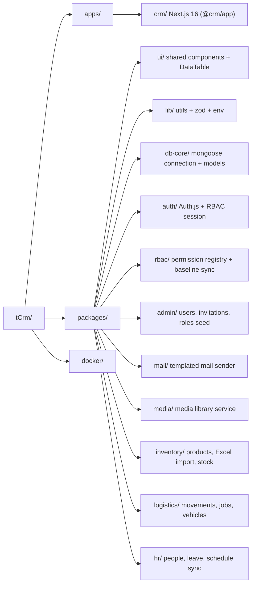
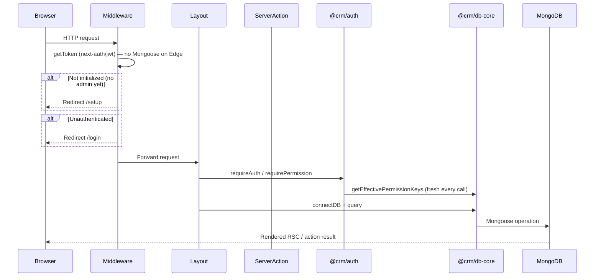
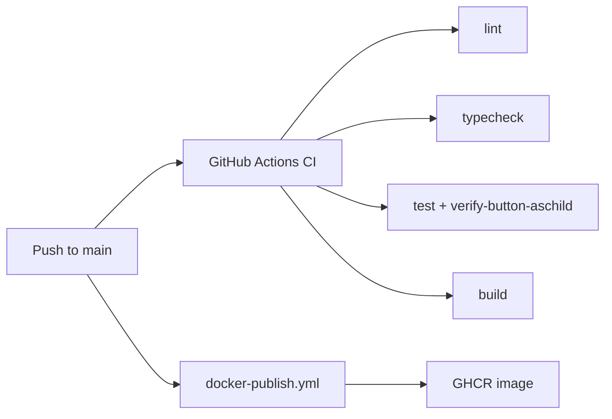

# tCrm Architecture

Single source of truth for system design, boundaries, and conventions.

**Pair with:** [rules.md](./rules.md), [design.md](./design.md), [AGENT_HANDOFF.md](./AGENT_HANDOFF.md)

**This file describes the rebuilt system.** The pre-rebuild codebase was deleted and rebuilt from scratch. If you find code or docs that reference `@crm/core` or `@crm/db`, it is either dead reference material (`_legacy-core-reference/`, kept only for porting old HR/accounting logic) or stale — flag it, don't build on it.

---

## 1. Vision & Goals

**tCrm** is an internal CRM with a live foundation (auth, RBAC, admin), inventory, logistics, builds, and job-first HR, with a path toward offers, bookkeeping, and multi-tenant SaaS.

| Goal | Approach |
|------|----------|
| Beautiful, consistent UX | 3SGP-derived shell + design system (shadcn New York + zinc) |
| Maintainable & extensible | Turborepo monorepo, feature-based packages |
| Production DevOps | Docker, GitHub Actions, Husky, Vitest |
| Flexible RBAC | Data-driven permissions — admin assigns without code changes |
| Installable | PWA support (manifest, service worker, install prompt) |

---

## 2. Monorepo Topology



### Package responsibilities

| Package | Purpose |
|---------|---------|
| `@crm/app` (`apps/crm`) | Main Next.js application — routes, app-specific UI |
| `@crm/ui` | Shared shadcn primitives, `Container`, `DataTable`, `EntitySheet` |
| `@crm/lib` | `cn()`, Zod schemas, env helpers (`isPublicRegistrationEnabled`, etc.) |
| `@crm/db-core` | Mongoose connection, models (User/Role/Permission, Product/Category/Supplier/Warehouse/StockLevel/StockAdjustment, Reservation/StockMovement/LogisticsJob/Vehicle/VehicleIncident, Employee/TimeOff/ScheduleEntry, MailTemplate, Media, Branding, Counter), repositories, branding/system/user helpers |
| `@crm/auth` | Auth.js v5 config, session helpers (`requireAuth`, `requirePermission`, `getCurrentUser`), `getEffectivePermissionKeys` |
| `@crm/rbac` | Permission-module registry (`registerPermissionModule`) + `ensurePermissionsSynced` baseline sync |
| `@crm/admin` | Engine permission module (`enginePermissions`), users/invitations/password-reset business logic, mail-template seeding |
| `@crm/mail` | Nodemailer wrapper, templated send, recipient resolution |
| `@crm/media` | Media library service (upload, dedup by hash, link-based media) + permission keys |
| `@crm/inventory` | Products, categories, suppliers, warehouses/stock, Excel import/export, inventory permission module |
| `@crm/logistics` | Stock movements, reservations, event jobs (parts list → pickup/drop-off employee → check-in), vehicle fleet, logistics permission module |
| `@crm/hr` | People directory, time off, schedule entries, monthly hours; HR permission module |
| `@crm/eslint-config`, `@crm/tsconfig` | Shared configs |

**Rule:** Cross-app shared code → `packages/`. Single-app code stays in `apps/crm/src/`. There is currently only one app (`apps/crm`); do not create `apps/landing` or similar without an explicit ask.

---

## 3. Tech Stack

| Layer | Choice |
|-------|--------|
| Framework | Next.js 16 App Router |
| UI | React 19 |
| Language | TypeScript strict |
| Styling | Tailwind CSS v4 |
| Components | shadcn/ui — New York + zinc |
| Database | MongoDB + Mongoose 9.x |
| Auth | Auth.js v5 (NextAuth beta), Credentials provider, JWT session |
| Validation | Zod |
| Monorepo | Turborepo + pnpm workspaces |
| Testing | Vitest (unit/integration), Playwright (E2E) |
| Deployment | Docker → GHCR (see `.github/workflows/docker-publish.yml`) |

---

## 4. Current Feature Surface

Everything that exists in the rebuilt app today. If a doc, comment, or plan references anything outside this list, treat it as future work, not current state.

| Area | Routes |
|------|--------|
| Auth | `/login`, `/register` (gated by `ALLOW_PUBLIC_REGISTRATION`), `/register/invite?token=`, `/reset-password?token=` |
| First-run setup | `/setup` (creates the first admin), `/setup/complete` |
| Dashboard | `/` — permission-filtered quick actions |
| Account | `/account` — profile, password change, effective-permissions summary |
| Help | `/help`, `/help/[slug]` — renders `docs/user-guide/*.md` |
| Inventory | `/inventory`, `/inventory/dashboard`, `/inventory/new`, `/inventory/count`, `/inventory/[sku]`, `/inventory/builds`, `/inventory/builds/new`, `/inventory/categories`, `/inventory/suppliers`, `/inventory/suppliers/[id]`, `/inventory/template`, `/inventory/export` |
| Logistics | `/logistics`, `/logistics/movements`, `/logistics/movements/new/{grn,pick,transfer}`, `/logistics/movements/[id]`, `/logistics/reservations`, `/logistics/jobs`, `/logistics/jobs/new`, `/logistics/jobs/[id]`, `/logistics/vehicles`, `/logistics/vehicles/[id]` |
| HR | `/hr`, `/hr/companies`, `/hr/people`, `/hr/people/[id]`, `/hr/calendar`, `/hr/leave`, `/hr/leave-summary`, `/hr/leave-summary/import`, `/hr/hours`, `/hr/me` |
| Admin | `/admin/users`, `/admin/users/new`, `/admin/users/invite`, `/admin/users/invitations`, `/admin/users/[id]`, `/admin/permissions`, `/admin/mail-templates`, `/admin/mail-templates/[id]`, `/admin/media`, `/admin/branding`, `/admin/warehouses`, `/admin/warehouses/[id]` |
| PWA | Web app manifest (`/manifest.webmanifest`), service worker, install prompt on dashboard |

Offers, bookkeeping, and secrets/titoktár are not built yet. `_legacy-core-reference/` holds leftover pre-rebuild HR/accounting logic as historical reference only — do not port teams/shifts/leave-import.

---

## 5. Runtime Architecture



**Edge constraint:** `apps/crm/src/middleware.ts` never imports Mongoose or `@crm/db-core`. It only checks a signed "initialized" cookie (`hasInitializedCookie`) and the session JWT (`getToken`). Admin-existence and DB-backed checks live in Node route handlers (`/api/system/initialized` pattern from the old build; the initialized state is now cookie-based — see `apps/crm/src/lib/initialized-cookie.ts`).

---

## 6. Auth & RBAC

### Auth.js v5 + Credentials

- JWT session strategy
- Credentials provider validates against `@crm/db-core` `User` model
- `session.user.permissions[]` is **recomputed from the database on every `session()` callback** (`packages/auth/src/config.ts`) — it is never trusted from a stale JWT claim, so a permission change takes effect on next request, no re-login needed.

### Permission model

```
Permission { key, label, group, isSystem }
Role       { key, name, permissionIds[], isSystem }
User       { email, roleIds[], directPermissionKeys[], isActive }
```

Effective permissions = union of all role permissions + `directPermissionKeys` (`packages/auth/src/permissions.ts::getEffectivePermissionKeys`).

### Defense in depth

1. **Middleware** — session presence only (Edge-safe)
2. **Route layouts** — `requirePermission(key)` → `notFound()` when denied
3. **Server Actions** — first line `await requirePermission(...)`
4. **Client UI** — sidebar hides items by permission (not a security boundary)

### Permission modules & the baseline sync

Permission keys are declared as `PermissionModule` objects (`packages/rbac/src/types.ts`) and registered at process start via `registerPermissionModule` — see `apps/crm/src/lib/rbac-bootstrap.ts`, which currently registers `enginePermissions`, `mediaPermissions`, `inventoryPermissions`, `logisticsPermissions`, and `hrPermissions`.

`ensurePermissionsSynced` (`packages/rbac/src/bootstrap.ts`) upserts every registered permission, then rebuilds the `admin` system role so it always contains **every currently registered key** — recomputed on each sync, never hand-maintained. Each module's own `roleTemplates` (e.g. a baseline `viewer` role) are merged in the same pass.

- Runs automatically once per server process via `ensureRbacBootstrapped()` (module-level guard) — called from the dashboard layout and from `/setup`.
- Can be forced on demand via **"Baseline jogosultságok szinkronizálása"** on `/admin/permissions` → `syncBaselinePermissionsAction` → `resyncRbac()` (bypasses the once-per-process guard).

**Adding a new permission:** add it to the relevant module's `permissions.ts` (or create a new `PermissionModule` and register it in `rbac-bootstrap.ts`), then run the baseline sync (automatic on next deploy, or manual via the admin UI). No seed script edit needed — there is no `packages/db/src/seed.ts` in the rebuilt app; the module registry *is* the seed.

**Known issue — see [AGENT_HANDOFF.md §Known issues](./AGENT_HANDOFF.md) for the current "admin role missing access keys" report** before assuming this pipeline is broken; the mechanism as coded is self-consistent, so treat this as a data/env question first.

---

## 7. Mail service

Database-driven templates (`MailTemplate` model in `@crm/db-core`) sent via `@crm/mail` (Nodemailer).

| Piece | Location |
|-------|----------|
| Model | `MailTemplate` (`@crm/db-core`) |
| Send API | `@crm/mail` → templated send with variable substitution |
| Seeding | `seedEngineMailTemplates()` (`@crm/admin`) — called from `/setup` |
| Invites | `@crm/admin` invitations → `/register/invite?token=` |
| Password reset | `@crm/admin` password-reset → `/reset-password?token=` |
| Admin UI | `/admin/mail-templates` (`mail:manage`) |

**Reply-To:** the user who triggered the action, else `SMTP_FROM`. **Env:** `SMTP_HOST`, `SMTP_PORT`, `SMTP_USER`, `SMTP_PASS`, `SMTP_FROM`, `SMTP_SECURE`, `APP_URL` (see `.env.example`).

When adding a new user-visible notification: add/extend a template via `@crm/admin`'s seed data, seed it, and send through `@crm/mail` — never call Nodemailer directly from `apps/crm`.

---

## 8. Data Layer

- **Connection:** singleton in `packages/db-core/src/connection.ts`, normalizes `retryWrites=false` for standalone MongoDB automatically
- **Models:** `packages/db-core/src/models/`
- **Repositories:** `packages/db-core/src/repositories/` (`AbstractRepository` base)
- **GridFS:** `getUploadsBucket()` for media uploads
- **No seed CLI:** first admin + baseline RBAC come from `/setup`, not a seed script

---

## 9. Server Actions Pattern

```typescript
'use server';

export type FormState =
  | { success: false; fieldErrors?: Record<string, string[]>; message?: string }
  | { success: true; message?: string };

export async function myAction(_prev: FormState, formData: FormData): Promise<FormState> {
  await requirePermission('module:write');
  const parsed = schema.safeParse(Object.fromEntries(formData));
  if (!parsed.success) return { success: false, fieldErrors: /* ... */ {} };
  await connectDB();
  // mutate
  revalidatePath('/path');
  return { success: true };
}
```

Client forms use `useActionState(action, initialState)`.

---

## 10. Application shell & navigation

Collapsible sidebar (`apps/crm/src/components/app-sidebar.tsx`) built on shadcn `Sidebar`. Current groups:

| Group (HU) | Routes | Gate |
|------------|--------|------|
| Általános | `/`, `/help`, `/hr/me` | authenticated; `/hr/me` also needs a linked employee profile (no permission key) |
| Készletkezelés | `/inventory/dashboard`, `/inventory`, `/inventory/count`, `/inventory/builds`, `/inventory/categories`, `/inventory/suppliers` | `inventory:read` (suppliers also accept `suppliers:read` / write / import) |
| Logisztika | `/logistics`, `/logistics/movements`, `/logistics/reservations`, `/logistics/jobs`, `/logistics/vehicles` | `logistics:read` (vehicles also accept `logistics:vehicles:read`); job checklists also open for assigned crew |
| HR | `/hr`, `/hr/people`, `/hr/calendar`, `/hr/leave`, `/hr/leave-summary`, `/hr/hours`, `/hr/companies` | any of `hr:read` / `hr:write` / `hr:approve` (`/hr/companies` needs `hr:write`) |
| Beállítások | `/account` | authenticated |
| Adminisztráció | `/admin/users`, `/admin/permissions`, `/admin/mail-templates`, `/admin/warehouses`, `/admin/media`, `/admin/branding` | group hidden unless `admin:access`; warehouses also need `warehouses:read` |

Branding (`app name`, logo) is read from `@crm/db-core` branding settings via `useBranding()` (`apps/crm/src/components/branding-provider.tsx`), not hardcoded.

### List & table UI standard (`@crm/ui`)

| Component | Use |
|-----------|-----|
| **`DataTable`** | All list/tabular views. Server mode: `parseDataTableQuery` → `buildDataTableMongoQuery` → pass `data`, `query`, `total`, `basePath`, `tableId`. Client mode: in-memory rows. |
| **`EntitySheet`** | Slide-over panels: filters, sort, columns, create forms, row quick-view. |

**Do not** add new raw shadcn `Table` list views — extend `DataTable`. The only documented exception is the RBAC permission matrix on `/admin/permissions` (role × permission checkbox grid).

### Documentation layers

| Layer | Path | Audience |
|-------|------|----------|
| Architecture (this file) | `docs/ARCHITECTURE.md` | Devs / agents |
| Conventions | `docs/rules.md` | Devs / agents |
| Design tokens & shell | `docs/design.md` | Devs / agents |
| Current status, known issues | `docs/AGENT_HANDOFF.md` | Devs / agents (read first) |
| User guide | `docs/user-guide/*.md` | CRM users, rendered at `/help`; also the content source for the in-app driver.js tour (`apps/crm/src/lib/tour/`) |

Keep the user guide and driver.js tour aligned with the real route list in §4 — when a route is added, removed, or re-gated, update the matching `docs/user-guide/*.md` frontmatter (`permissions:`) and, if the route is part of the guided tour, its `data-tour` step.

---

## 11. Design System

See [design.md](./design.md) for tokens, typography, layout shell, and component patterns.

---

## 12. Testing Strategy

See [TESTING.md](./TESTING.md) for the current test inventory and commands. Summary: Vitest unit/integration tests co-located per package, one Playwright E2E spec (`apps/crm/e2e/auth.spec.ts`), CI runs lint/typecheck/unit tests/build only (E2E is local-only).

---

## 13. CI/CD & Deployment



Local development:

```bash
docker compose -f docker/docker-compose.yml up --build
```

Brings up MongoDB, Mongo Express (`:8081`), and the CRM app (`:3000`).

---

## 14. Roadmap

The original plan (offers → accounting/multi-tenant SaaS) still holds as the long-term direction. **Phase 1 (inventory), Phase 2 (logistics + builds), and Phase 3 (job-first HR) are live.** Jobs are deliberately simple (rebuilt 2026-08-24, see `docs/logistics-jobs-legacy.md` for the earlier demand-planning engine this replaced): logistics writes a flat item list with a warehouse per line, assigns one employee responsible for pickup and one for drop-off (can be the same person) plus a read-only crew, and HR `/hr/me` deep-links into those tasks.

---

## 15. Architectural Decision Records

### ADR-001: Auth.js v5 over custom JWT

**Decision:** Auth.js v5 with Credentials + JWT strategy, but permissions resolved from DB on every `session()` call rather than cached in the token.
**Rationale:** App Router integration, middleware support, and permission changes apply without forcing re-login.

### ADR-002: Dynamic RBAC over role enum, module registry over hand-maintained seed

**Decision:** Permission keys live in code as `PermissionModule` descriptors registered at boot; the `admin` role is always recomputed to cover every registered key rather than hand-maintained in a seed file.
**Rationale:** New permissions can't silently miss being granted to `admin`; adding a permission is a one-file change plus a sync, not a seed-script edit.

### ADR-003: Turborepo + pnpm monorepo

**Decision:** Turborepo orchestration, pnpm workspaces, one app (`apps/crm`) today.
**Rationale:** Cacheable builds, strict dependency graph, ready to add a second app later without restructuring.

---

*Last updated: 2026-08 (demand-first logistics jobs + job-first HR).*
