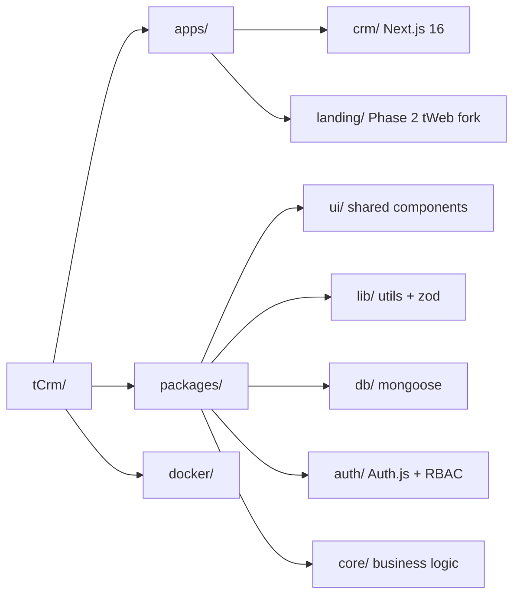
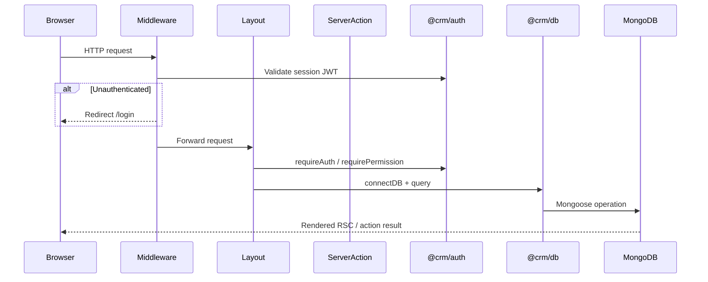
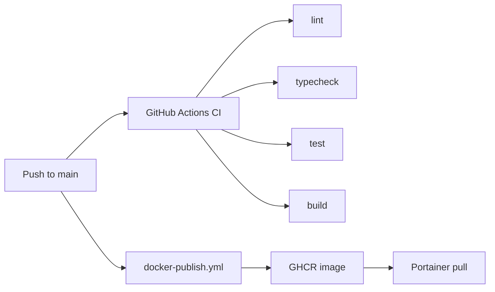

# tCrm Architecture

Single source of truth for system design, boundaries, and conventions.

**Pair with:** [rules.md](./rules.md), [design.md](./design.md)

---

## 1. Vision & Goals

**tCrm** is an internal CRM for full operations (inventory, builds, logistics, offers, accounting) with a path to a sellable multi-tenant SaaS product.

| Goal | Approach |
|------|----------|
| Beautiful, consistent UX | 3SGP shell + design system (shadcn New York + zinc) |
| Maintainable & extensible | Turborepo monorepo, feature-based packages |
| Production DevOps | Docker, GitHub Actions, Husky, Vitest |
| Flexible RBAC | Data-driven permissions — admin assigns without code changes |
| Data-centric UI | Dynamic tables/filters (Phase 1) |

---

## 2. Monorepo Topology



### Package responsibilities

| Package | Purpose |
|---------|---------|
| `@crm/app` (`apps/crm`) | Main Next.js application — routes, app-specific UI |
| `@crm/ui` | Shared shadcn primitives + Container |
| `@crm/lib` | `cn()`, Zod schemas, date/pagination utils |
| `@crm/db` | Mongoose connection, models, repositories, seed |
| `@crm/auth` | Auth.js v5, session helpers, permission resolution |
| `@crm/core` | Cross-cutting business logic (Phase 1+) |
| `@crm/eslint-config` | Shared ESLint flat configs |
| `@crm/tsconfig` | Shared TypeScript configs |

**Rule:** Cross-app shared code → `packages/`. Single-app code stays in `apps/crm/src/`.

---

## 3. Tech Stack

| Layer | Choice | Version |
|-------|--------|---------|
| Framework | Next.js App Router | 16.1.6 |
| UI | React | 19.2 |
| Language | TypeScript | 5.x strict |
| Styling | Tailwind CSS | v4 |
| Components | shadcn/ui | New York + zinc |
| Database | MongoDB + Mongoose | 9.x |
| Auth | Auth.js (NextAuth v5) | beta.30 |
| Validation | Zod | 4.x |
| Monorepo | Turborepo + pnpm | — |
| Testing | Vitest | 4.x |
| Deployment | Docker → GHCR → Portainer | — |

---

## 4. App Boundaries

### `apps/crm` (Phase 0 — active)

- All CRM routes, layouts, and app-specific components
- Server Actions co-located with routes (`actions.ts`)
- Imports workspace packages via `@crm/*`

### `apps/landing` (Phase 2 — deferred)

Fork of [tWeb / webshop-engine](https://github.com/tomkoooo/tWeb) for marketing + ordering sites. Will share `@crm/ui` and `@crm/db` once Tailwind/Next versions align.

---

## 5. Runtime Architecture



---

## 6. Auth & RBAC

### Auth.js v5 + Credentials

- JWT session strategy (8-hour max age)
- Credentials provider validates against `@crm/db` User model
- Session includes `user.id` and `user.permissions[]`

### Permission model

```
Permission { key, label, group, isSystem }
Role       { key, name, permissionIds[] }
User       { email, roleIds[], directPermissionKeys[] }
```

Effective permissions = union of all role permissions + direct permission keys.

### Defense in depth

1. **Middleware** — session presence; redirect unauthenticated users
2. **Route layouts** — `requireAuth()` / `requirePermission(key)` → `notFound()`
3. **Server Actions** — first line `await requirePermission(...)`
4. **Client UI** — sidebar hides items (not security)

### Adding a new permission

1. Add key to seed (`packages/db/src/seed.ts`) or admin UI
2. Assign to roles via `/admin/permissions`
3. Guard routes/actions with `requirePermission('module:action')`
4. Optionally hide nav items client-side

No code change needed for **assignment** — only for **new keys**.

---

## 7. Data Layer

- **Connection:** Singleton in `packages/db/src/connection.ts`
- **Models:** `packages/db/src/models/`
- **Repositories:** `AbstractRepository` base + domain repos
- **GridFS:** `getUploadsBucket()` for file uploads (Phase 1+)
- **Seed:** `pnpm --filter @crm/db seed`

---

## 8. Server Actions Pattern

```typescript
'use server';

export type FormState =
  | { success: false; fieldErrors?: Record<string, string[]>; message?: string }
  | { success: true; message?: string };

export async function myAction(_prev: FormState, formData: FormData): Promise<FormState> {
  await requirePermission('module:write');
  const parsed = schema.safeParse(Object.fromEntries(formData));
  if (!parsed.success) return { success: false, fieldErrors: ... };
  await connectDB();
  // mutate
  revalidatePath('/path');
  return { success: true };
}
```

Client forms use `useActionState(action, initialState)`.

---

## 9. Application shell & navigation

The CRM uses a **collapsible sidebar** (`apps/crm/src/components/app-sidebar.tsx`) built on shadcn `Sidebar` + Radix `Collapsible` via `SidebarNavGroup`.

| Group (HU) | Routes | Typical permissions |
|------------|--------|-------------------|
| Általános | `/` (dashboard) | authenticated |
| Készletkezelés | `/inventory`, `/inventory/categories`, `/inventory/suppliers`, `/inventory/builds` | `inventory:read`, `suppliers:*` |
| Logisztika | `/logistics`, `/logistics/movements`, `/logistics/reservations` | `logistics:read` |
| Értékesítés | `/offers`, `/builds` | `offers:read`, `inventory:read` |
| Beállítások | `/account` | authenticated |
| Adminisztráció | `/admin/users`, `/admin/permissions`, `/admin/warehouses` | `admin:access` + module keys |

Groups expand/collapse independently; the active route’s group opens by default. Breadcrumb labels are localized in `app-header.tsx` (`translateSegment`).

**Suppliers (beszállítók/partnerek):** managed at `/inventory/suppliers` (`suppliers:read`, `suppliers:manage` — no `admin:access` required). Legacy `/admin/suppliers` redirects here. Each supplier has a unique `key` (slug) used as `crm_supplier_slug` in Excel.

### List & table UI standard (`@crm/ui`)

| Component | Use |
|-----------|-----|
| **`DataTable`** | All list / tabular views. Modes: **server** (URL + Mongo via `parseDataTableQuery` / `buildDataTableMongoQuery`) or **client** (in-memory rows). Supports `tableId` + localStorage column prefs, `mongoKey` for nested fields, optional `image` columns, header tooltips, compact toolbar icons (`size-2.5`). |
| **`EntitySheet`** | Slide-over panels: filters, sort, columns, create forms, row quick-view. |

**Rules:** Do not add new raw shadcn `Table` list views. Use `variant="compact"` for dashboard snippets.

**Documented exceptions:** RBAC permission matrix (`/admin/permissions`) — role × permission checkboxes. Product detail sub-grids (BOM, stock by warehouse) may stay static `Table` until migrated.

**Product images:** Up to five Excel hints (`bild1`–`bild5` → `externalImageHints[]`) plus GridFS `imageIds[]`. List table shows optional **Kép előnézet** (first image) and **Képek (db)** count; full gallery on product detail. Thumbnails: `GET /api/inventory/images/[id]` or first http(s) hint.

**Import categories:** CRM uses simplified `Category` documents (slug + SKU prefix). Excel import requires `crm_category_slug` per row; shipper taxonomy columns (`cat*Name_*`) are stored on the product as `shipperCategoryPath` only. See [inventory.md](./inventory.md).

**Import SKUs:** `product_id_SM` → CRM SKU (`Product.sku`, unique in tCrm). `product_id` → supplier/manufacturer SKU (`Product.supplierSku`). Do not confuse them in UI or docs.

**Import suppliers:** `crm_supplier_slug` per row (`Supplier.key`), or optional default supplier in the import modal when every row omits the column.

### Operational flow documentation (living doc)

[`docs/inventory_and_logistics_flows.md`](./inventory_and_logistics_flows.md) is the **canonical flow map** (Mermaid + tables). It must stay aligned with the product:

| Trigger | Action |
|---------|--------|
| Phase milestone completed | Extend §0 CRM overview; add module section |
| Import / logistics / RBAC behavior change | Update diagrams + glossary in same PR |
| New major routes in sidebar | Update §0 and navigation notes |

Agents and contributors: follow [`.cursor/rules/flows-documentation.mdc`](../.cursor/rules/flows-documentation.mdc). `docs/ARCHITECTURE.md` describes structure; the flows doc describes **what happens step by step**.

---

## 10. Design System

See [design.md](./design.md) for tokens, typography, layout shell, and component patterns.

---

## 11. Testing Strategy

| Layer | Tool | CI |
|-------|------|-----|
| Utils / validation | Vitest | Yes |
| Auth helpers | Vitest | Yes |
| Server Actions | Vitest (schema tests) | Yes |
| Components | Vitest + Testing Library | Yes |
| Integration (Mongo) | Vitest + memory server | Local only |

---

## 12. CI/CD & Deployment



Local development:

```bash
docker compose -f docker/docker-compose.yml up
```

---

## 13. Future Plans

| Phase | Scope |
|-------|-------|
| Phase 1 | Inventory — product schema, Excel parser, dynamic DataTable |
| Phase 2 ✓ | Logistics, warehouses, suppliers, builds/BOM, user/account admin, inventory DataTable columns |
| Phase 3 | Offers, `apps/landing` (tWeb fork), accounting, multi-tenant SaaS, reporting |

---

## 14. Architectural Decision Records

### ADR-001: Auth.js v5 over custom JWT

**Context:** 3SGP uses custom JWT; tWeb uses Auth.js v5.  
**Decision:** Auth.js v5 with Credentials + JWT strategy.  
**Rationale:** App Router integration, middleware support, future OAuth ready.

### ADR-002: Dynamic RBAC over role enum

**Context:** 3SGP uses hardcoded role strings.  
**Decision:** Permission keys in DB; roles are permission containers.  
**Rationale:** Admin can assign access without deploys.

### ADR-003: Turborepo + pnpm monorepo

**Context:** Multiple apps (crm, landing) and shared packages.  
**Decision:** Turborepo orchestration, pnpm workspaces.  
**Rationale:** Cacheable builds, strict dependency graph.

---

*Last updated: May 2026*
