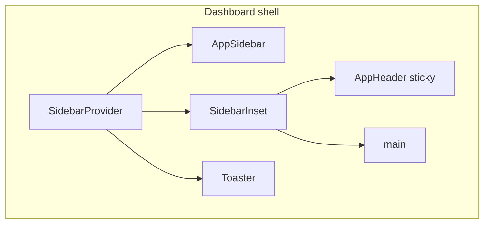

# Frontend Design System — tCrm

Portable design reference adapted from 3SGP. Use with [rules.md](./rules.md) and [ARCHITECTURE.md](./ARCHITECTURE.md).

**Canonical sources:** `apps/crm/src/app/globals.css`, shell components in `apps/crm/src/components/`.

---

## 1. Design Philosophy

### Dashboard-first admin app

Persistent application shell:

- Left **sidebar** (collapsible desktop, sheet on mobile)
- **Sticky header** with toggle, breadcrumbs, theme switch
- **Scrollable main** in `<Container>`

### Semantic tokens over raw colors

Use `bg-background`, `text-foreground`, `bg-primary`, `bg-sidebar`, etc.

> **BRAND COLOR PLACEHOLDER:** `--primary` and `--secondary` in `globals.css` are copied from 3SGP (orange + deep blue). Replace with tCrm brand colors before production, or via **Arculat** (`/admin/branding`) for app name/logo — token colors themselves are still edited in `globals.css`.

### Permission-aware content

Same shell for all users. Dashboard and nav branch on `user.permissions[]`, recomputed fresh on every request (see ARCHITECTURE.md §6) — never assume a client-cached permission list.

---

## 2. Technology Stack

| Layer | Choice |
|-------|--------|
| Framework | Next.js 16 App Router |
| UI | React 19 |
| Styling | Tailwind CSS v4 |
| Components | shadcn/ui New York + zinc |
| Icons | lucide-react |
| Fonts | Geist Sans + Geist Mono |
| Toasts | Sonner |
| Theming | next-themes |
| PWA | Web manifest + service worker + install prompt |

---

## 3. Design Tokens

Tokens in `apps/crm/src/app/globals.css`. Tailwind v4 bridges via `@theme inline`.

| Token | Role |
|-------|------|
| `--primary` | Brand accent — buttons, avatar fallback |
| `--secondary` | Deep emphasis |
| `--radius` | 0.625rem base radius |
| `--sidebar-*` | Sidebar chrome |
| `--chart-1`…`5` | Reserved for future dashboard charts |

Dark mode: `.dark { … }` + `ThemeProvider attribute="class"` on `<html>`.

Custom utilities:

| Class | Purpose |
|-------|---------|
| `.smart-min-dvh` | Mobile full-height via `--dvh` |
| `.invis-scroll` | Hidden scrollbar (breadcrumbs) |

---

## 4. Typography & Spacing

| Role | Classes |
|------|---------|
| Dashboard welcome | `text-3xl font-bold` |
| Page title | `text-2xl font-bold` |
| Subtitle | `text-sm text-muted-foreground` |
| Stat label | `text-sm font-medium` |
| Stat value | `text-2xl font-bold` |
| Table cells | `text-xs` |

Container: `@crm/ui` → `md:container md:mx-auto p-4 w-full`

Page rhythm: `flex flex-col gap-4 md:gap-6`

---

## 5. Layout System



Auth routes (`/login`, `/register`, `/reset-password`) and setup routes (`/setup`) use a minimal centered layout — **no sidebar**.

Sidebar: 16rem desktop, 18rem mobile sheet, toggle shortcut `Ctrl/Cmd+B`.

---

## 6. Component Inventory

### shadcn primitives (`apps/crm/src/components/ui/`)

Button, Card, Input, Label, Sidebar, Sheet, Breadcrumb, Avatar, Badge, Table, Checkbox, Separator, Skeleton, Sonner, Tooltip, etc.

Install via shadcn CLI with `components.json`: **new-york**, **zinc**, **cssVariables**.

### App components

| Component | Purpose |
|-----------|---------|
| `app-sidebar.tsx` | Permission-aware navigation |
| `app-header.tsx` | Breadcrumbs + theme toggle |
| `theme-provider.tsx` | next-themes wrapper |
| `branding-provider.tsx` | App name/logo from `@crm/db-core` branding settings |
| `dvh-var-setter.tsx` | Mobile viewport height |
| `pwa-install-prompt.tsx`, `pwa-service-worker.tsx` | PWA install UX |

---

## 7. Page Patterns

### Dashboard home

1. Welcome (`text-3xl`) + subtitle
2. Quick actions filtered by permission

### Stat card

```tsx
<Card>
  <CardHeader className="flex flex-row items-center justify-between space-y-0 pb-2">
    <CardTitle className="text-sm font-medium">Label</CardTitle>
    <Icon className="h-4 w-4 text-muted-foreground" />
  </CardHeader>
  <CardContent>
    <div className="text-2xl font-bold">{value}</div>
  </CardContent>
</Card>
```

### Empty states

**Dashed hero:** `border-2 border-dashed rounded-xl py-20`
**Muted panel:** `bg-muted/10 border rounded-lg py-12` + CTA

### Forms

Server Actions + `useActionState`, `gap-6` form, `gap-2` fields, red asterisk on required.

---

## 8. DataTable & EntitySheet (`@crm/ui`)

**DataTable** — mandatory for list views (currently: Felhasználók, E-mail sablonok). Compact toolbar: Keresés · Szűrők · Rendezés · Oszlopok (each opens **EntitySheet**). URL drives server filters; `tableId` persists visible columns in `localStorage`.

```typescript
// Server list page — fetch only; no DataTable here (RSC cannot pass rowHref/render)
const query = parseDataTableQuery(await searchParams);
const { filter, sort, skip, limit } = buildDataTableMongoQuery(query, columns);
// … load rows …

<UsersTable data={rows} columns={columns} query={query} total={total} />
```

**Column types:** `string` | `number` | `boolean` | `enum` | `date` | `image`.

**EntitySheet** — reusable slide-over (`size`: sm|md|lg|xl) for filters, create forms, row detail.

**Client mode:** `mode="client"` for in-memory data. Same chrome; filters merge URL + default `query` prop.

---

## 9. Navigation Map (current)

| Path | Module | Permission |
|------|--------|------------|
| `/` | Dashboard | authenticated |
| `/account` | Account | authenticated |
| `/help`, `/help/[slug]` | Súgó | authenticated (individual articles may require a permission via frontmatter) |
| `/admin/users` | Users | `users:read` |
| `/admin/permissions` | RBAC | `roles:manage` |
| `/admin/mail-templates` | Mail templates | `mail:manage` |
| `/admin/media` | Media library | `media:read` |
| `/admin/branding` | Branding | `admin:access` |
| `/inventory` | Products | `inventory:read` |
| `/inventory/dashboard` | Inventory KPIs | `inventory:read` |
| `/inventory/categories` | Categories | `inventory:read` |
| `/inventory/suppliers` | Suppliers | `suppliers:read` (or inventory write/import) |
| `/admin/warehouses` | Warehouses | `warehouses:read` |

---

## 10. Responsive & Accessibility

- Mobile sidebar → Sheet below 768px
- Breadcrumbs: horizontal scroll, no wrap
- No viewport zoom lock — accessible pinch-to-zoom
- Loading spinner: `role="status"` + `sr-only`
- Dark mode toggle in header

---

## 11. Bootstrap Checklist (for a brand-new module)

1. Confirm the route belongs in §9 — update this table
2. shadcn components as needed (CLI, new-york + zinc)
3. Wrap the page in `<Container>`; use `DataTable`/`EntitySheet` for any list
4. Guard with `requirePermission` in the layout/page and again in every Server Action
5. Add/update the sidebar entry in `app-sidebar.tsx` behind the matching permission check
6. Add a `docs/user-guide/*.md` chapter with correct `permissions:` frontmatter

---

## 12. Known Differences from 3SGP

| 3SGP | tCrm |
|------|------|
| Custom JWT auth | Auth.js v5, permissions recomputed from DB per request |
| Role enum | Dynamic permission keys via module registry |
| Login in full shell | `(auth)` layout without sidebar |
| Dark mode unwired | ThemeProvider from day one |
| PWA viewport lock | Standard accessible viewport |
| No PWA | Installable PWA with service worker |

---

*Adapted from 3SGP design system — updated 2026-07 (post-rebuild).*
