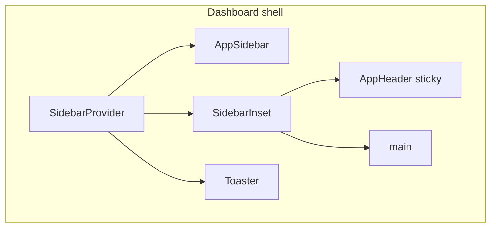

# Frontend Design System — tCrm

Portable design reference adapted from 3SGP. Use with [rules.md](./rules.md) and [ARCHITECTURE.md](./ARCHITECTURE.md).

**Canonical sources:** `apps/crm/src/app/globals.css`, shell components in `apps/crm/src/components/`.

---

## 1. Design Philosophy

### Dashboard-first admin app

Persistent application shell:

- Left **sidebar** (collapsible desktop, sheet on mobile)
- **Sticky header** with toggle, breadcrumbs, theme switch
- **Scrollable main** in `<Container>`

### Semantic tokens over raw colors

Use `bg-background`, `text-foreground`, `bg-primary`, `bg-sidebar`, etc.

> **BRAND COLOR PLACEHOLDER:** `--primary` and `--secondary` in `globals.css` are copied from 3SGP (orange + deep blue). Replace with tCrm brand colors before production.

### Permission-aware content

Same shell for all users. Dashboard and nav branch on `user.permissions[]`.

---

## 2. Technology Stack

| Layer | Choice |
|-------|--------|
| Framework | Next.js 16.1.6 App Router |
| UI | React 19.2 |
| Styling | Tailwind CSS v4 |
| Components | shadcn/ui New York + zinc |
| Icons | lucide-react |
| Fonts | Geist Sans + Geist Mono |
| Toasts | Sonner |
| Theming | next-themes (wired from Phase 0) |

---

## 3. Design Tokens

Tokens in `apps/crm/src/app/globals.css`. Tailwind v4 bridges via `@theme inline`.

| Token | Role |
|-------|------|
| `--primary` | Brand accent — buttons, avatar fallback |
| `--secondary` | Deep emphasis |
| `--radius` | 0.625rem base radius |
| `--sidebar-*` | Sidebar chrome |
| `--chart-1`…`5` | Dashboard charts |

Dark mode: `.dark { … }` + `ThemeProvider attribute="class"` on `<html>`.

Custom utilities:

| Class | Purpose |
|-------|---------|
| `.smart-min-dvh` | Mobile full-height via `--dvh` |
| `.invis-scroll` | Hidden scrollbar (breadcrumbs) |

---

## 4. Typography & Spacing

| Role | Classes |
|------|---------|
| Dashboard welcome | `text-3xl font-bold` |
| Page title | `text-2xl font-bold` |
| Subtitle | `text-sm text-muted-foreground` |
| Stat label | `text-sm font-medium` |
| Stat value | `text-2xl font-bold` |
| Table cells | `text-xs` |

Container: `@crm/ui` → `md:container md:mx-auto p-4 w-full`

Page rhythm: `flex flex-col gap-4 md:gap-6`

---

## 5. Layout System



Auth routes (`/login`, `/register`) use minimal centered layout — **no sidebar**.

Sidebar: 16rem desktop, 18rem mobile sheet, toggle shortcut `Ctrl/Cmd+B`.

---

## 6. Component Inventory

### shadcn primitives (`apps/crm/src/components/ui/`)

Button, Card, Input, Label, Sidebar, Sheet, Breadcrumb, Avatar, Badge, Table, Checkbox, Separator, Skeleton, Sonner, Tooltip, etc.

Install via shadcn CLI with `components.json`: **new-york**, **zinc**, **cssVariables**.

### App components

| Component | Purpose |
|-----------|---------|
| `app-sidebar.tsx` | Permission-aware navigation |
| `app-header.tsx` | Breadcrumbs + theme toggle |
| `theme-provider.tsx` | next-themes wrapper |
| `dvh-var-setter.tsx` | Mobile viewport height |

---

## 7. Page Patterns

### Dashboard home

1. Welcome (`text-3xl`) + subtitle
2. Stat grid (`grid-cols-1 md:grid-cols-2 lg:grid-cols-4`)
3. Performance / getting-started card
4. Quick actions filtered by permission

### Stat card

```tsx
<Card>
  <CardHeader className="flex flex-row items-center justify-between space-y-0 pb-2">
    <CardTitle className="text-sm font-medium">Label</CardTitle>
    <Icon className="h-4 w-4 text-muted-foreground" />
  </CardHeader>
  <CardContent>
    <div className="text-2xl font-bold">{value}</div>
  </CardContent>
</Card>
```

### Empty states

**Dashed hero:** `border-2 border-dashed rounded-xl py-20`  
**Muted panel:** `bg-muted/10 border rounded-lg py-12` + CTA

### Forms

Server Actions + `useActionState`, `gap-6` form, `gap-2` fields, red asterisk on required.

---

## 8. DataTable & EntitySheet (`@crm/ui`)

**DataTable** — mandatory for list views. Compact toolbar: Keresés · Szűrők · Rendezés · Oszlopok (each opens **EntitySheet**). URL drives server filters; `tableId` persists visible columns in `localStorage`.

```typescript
// Server list page
const query = parseDataTableQuery(await searchParams);
const { filter, sort, skip, limit } = buildDataTableMongoQuery(query, columns);

<DataTable
  tableId="inventory-products"
  mode="server"
  data={rows}
  columns={columns}
  query={query}
  total={total}
  basePath="/inventory"
  rowHref={(r) => `/inventory/${r.sku}`}
  rowOpen="sheet"  // optional rowDetail preview
/>
```

**Column types:** `string` | `number` | `boolean` | `enum` | `date` | `image` (`thumbnailUrl` + `DataTableImageCell`).

**EntitySheet** — reusable slide-over (`size`: sm|md|lg|xl) for filters, create forms, row detail. Do not stack large Cards above tables for create flows.

**Client mode:** `mode="client"` for in-memory data (builds, dashboard snippets). Same chrome; filters merge URL + default `query` prop.

---

## 9. Navigation Map (forward-looking)

| Path | Module | Permission |
|------|--------|------------|
| `/` | Dashboard | authenticated |
| `/inventory` | Inventory | `inventory:read` |
| `/logistics` | Logistics | `logistics:read` |
| `/offers` | Offers | `offers:read` |
| `/builds` | Builds | `inventory:read` |
| `/admin/permissions` | RBAC | `roles:manage` |
| `/admin/users` | Users | `users:read` |

---

## 10. Responsive & Accessibility

- Mobile sidebar → Sheet below 768px
- Breadcrumbs: horizontal scroll, no wrap
- **No viewport zoom lock** (unlike 3SGP PWA) — better accessibility
- Loading spinner: `role="status"` + `sr-only`
- Dark mode toggle in header

---

## 11. Bootstrap Checklist

1. Copy tokens from `globals.css`; set brand colors
2. shadcn init: new-york + zinc
3. Shell: Container, AppSidebar, AppHeader, route groups
4. ThemeProvider + dark toggle
5. RBAC-aware sidebar groups
6. Dashboard stat grid template

---

## 12. Known Differences from 3SGP

| 3SGP | tCrm |
|------|------|
| Hungarian UI | English (i18n Phase 2) |
| Custom JWT auth | Auth.js v5 |
| Role enum | Dynamic permission keys |
| Login in full shell | `(auth)` layout without sidebar |
| Dark mode unwired | ThemeProvider from day one |
| PWA viewport lock | Standard accessible viewport |

---

*Adapted from 3SGP design system — May 2026*
