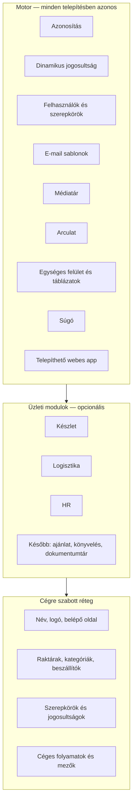
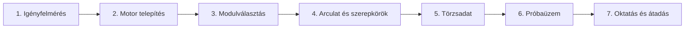

# ERP-motor — moduláris üzleti rendszerkonstruktor

**Termékleírás és bevezetési alap.** Ez a dokumentum a rendszert **általános motorként** mutatja be: egy új céghez a motor változatlanul telepíthető, a cégre szabás pedig rétegekben történik — kód nélkül, ahol lehet, és célzott fejlesztéssel, ahol a folyamatok egyediek.

A jelenlegi éles implementáció egy konkrét szervezetre van szabva. Az alatta lévő platform ettől független: **ugyanaz a motor, más arculat, más törzsadat, más szerepkörök, más bekapcsolt modulok.**

---

## 1. Mit szállítunk

Nem egyetlen cégre írt egyedi szoftvert, hanem egy **összerakható ERP/CRM motort**:

| Réteg | Mit jelent | Ki állítja |
|-------|------------|------------|
| **Motor** | Bejelentkezés, jogosultság, felhasználók, e-mail, médiatár, arculat, súgó, telepíthető webes alkalmazás, egységes felület | A platform — minden ügyfélnél ugyanaz |
| **Üzleti modulok** | Készlet, logisztika, HR (később: ajánlat, könyvelés, dokumentumtár) | Be- és kikapcsolhatók; a cég csak azt kapja, amire szüksége van |
| **Cégre szabás** | Név, logó, raktárak, szerepkörök, e-mail szövegek, kategóriák, folyamatok | Admin felületen, vagy — ha a folyamat eltér — egy vékony, céges csomagban |

**Ígéret:** egy új szervezethez hetek alatt éles rendszer állítható, nem zöldmezős egyedi fejlesztés. A motor kész; a munka a cég folyamatainak ráültetése.

---

## 2. Miért konstruktor, nem „egy app”

A konstruktor azt jelenti, hogy a rendszer **építőkockákból** áll, és egy új céghez nem másoljuk át a kódot, hanem:

1. **Telepítjük a motort** (saját adatbázis, saját domain, saját admin).
2. **Kiválasztjuk a modulokat** (készlet igen / logisztika igen / HR igen — vagy csak egy részük).
3. **Cégre szabjuk** az arculatot, szerepköröket, törzsadatot és — ha kell — a folyamatokat.
4. **Átadjuk** a súgót, a bevezetési checklistet és a jogosultsági mátrixot.

A motor **nem tudja**, hogy melyik cég használja. A cég neve, logója, raktárai és a menüben látható modulok adatból jönnek, nem a kódból.

---

## 3. Alaprendszer (motor)

Ez a rész minden ügyfélnél ugyanaz. E nélkül nincs ERP: nincs biztonságos belépés, nincs „ki mit láthat”, nincs üzemeltetés.

### 3.1 Első indítás

Üres adatbázisnál a rendszer **beállítás varázslóra** visz. Az első adminisztrátor itt jön létre — nincs előre beégetett jelszó a kódban. Ettől a ponttól a cég sajátja a rendszer.

### 3.2 Azonosítás és fiók

- Bejelentkezés szervezeti e-mail + jelszó.
- Meghívó linkkel történő beléptetés (a munkatárs maga állítja a jelszót).
- Jelszó-visszaállítás e-mailből.
- Opcionális nyilvános regisztráció (alapból kikapcsolva).
- Saját fiók: profil, jelszócsere, **tényleges jogosultságok** áttekintése.

A jogosultság **minden kérésnél** az adatbázisból számolódik. Ha az admin elvesz vagy ad egy jogot, az a következő oldalletöltésnél érvényes — nem kell újra belépni.

### 3.3 Dinamikus jogosultság (RBAC)

Nem merev „admin / user” lista. A motor **jogosultsági kulcsokat** ismer (például „készletet lát”, „szállítást indít”, „szabadságot jóváhagy”). Ezekből **szerepkörök** rakhatók össze a felületen, kódmódosítás nélkül.

| Szint | Példa |
|-------|--------|
| Rendszerkulcsok | Admin belépés, felhasználók, szerepkörök, e-mail sablonok |
| Modulkulcsok | Készlet olvasás/írás/import, logisztika, jármű, HR saját/olvasás/írás/jóváhagyás |
| Szerepkör | „Raktáros”, „Sofőr”, „HR-es”, „Csak olvasó” — a cég nevezi el és tölti fel kulcsokkal |
| Közvetlen jog | Ritka kivétel: egy ember extra kulcsot kap szerepkör nélkül |

**Védelem négy rétegben:**

1. Belépés nélkül nincs belső oldal.
2. Az oldalak jogosultság nélkül nem nyílnak meg.
3. Minden módosítás (űrlap, művelet) újra ellenőrzi a jogot.
4. A menü csak azt mutatja, amihez van jog — ez kényelem, nem a biztonság alapja.

Új modul belépésekor a kulcsok **regisztrálódnak**. A rendszergazda szerepkör automatikusan megkapja az összes aktuális kulcsot. A többi szerepkört a cég adminja állítja.

### 3.4 Felhasználók és meghívók

- Felhasználólista, aktív/inaktív állapot.
- Meghívó e-mail, lejáró token, elfogadó oldal.
- Szerepkör hozzárendelés felületen.

Egy új cégnél a bevezetés tipikusan: első admin a varázslóval → szerepkörök kiosztása → meghívók a csapatnak.

### 3.5 E-mail sablonok

A rendszerüzenetek **adatbázisban szerkeszthető sablonok**, nem a kódba égetett szövegek.

- Meghívó, jelszó-visszaállítás — a motor része.
- Üzleti események (például szállítás állapota) — a modul hozza a sablont, a cég átírhatja a szöveget.
- Változók: név, link, lejárat, feladó.
- Bekapcsolható / kikapcsolható, címzettek szerepkörre vagy személyre szűkíthetők.

Így ugyanaz a motor magyar, angol vagy céges hangvételű leveleket küld — kód nélkül.

### 3.6 Médiatár

Központi kép- és fájltár (feltöltés, külső kép URL, keresés). Az arculat, a termékfotók, a járműokmányok és az összeszerelési útmutatók mind innen hivatkoznak. Egy fájl többször felhasználható, nem kell újra feltölteni.

### 3.7 Arculat (white-label)

A cég **percek alatt** a saját rendszerének láttathatja az alkalmazást, újrafordítás nélkül:

- Alkalmazásnév és cégnév
- Logó és favicon
- Belépő oldal címe, alcíme, háttérképe
- Lábléc szövege

A színek a design-rendszer tokenjeiből jönnek; egy új brandhez a tokenek cseréje a céges csomag része. Világos / sötét mód beépített.

### 3.8 Súgó és betanítás

A súgó **magyar, lépésről lépésre** fejezetekből áll, a felületen olvasható. A fejezetek jogosultság szerint szűrődnek: aki nem látja a készletet, annak a készlet súgója sem jelenik meg.

Opcionális **vezetett körbejárás** a felületen (első belépés, új modul). Új cégnél a súgó szövege a cég folyamataira cserélhető — ugyanaz a súgómotor.

### 3.9 Telepíthető webes alkalmazás (PWA)

A rendszer böngészőből **telepíthető** (asztal, telefon): saját ikon, saját név az arculatból. Nincs külön natív app a napi üzemhez.

### 3.10 Egységes felület

Minden listanézet ugyanazt a táblázatmotort használja: keresés, szűrés, rendezés, oszlopok, lapozás. A részletek és űrlapok csúszó panelben vagy azonos oldalon szerkeszthetők. Új modul ehhez a mintához csatlakozik — nem kap saját, idegen kinézetet.

---

## 4. Üzleti modulok (kész építőkockák)

A modulok **csomagok**. A motorhoz csatlakoznak: saját jogosultságok, saját menü, saját adatmodell. Egy céghez elég annyi modult bekapcsolni, amennyi a működéshez kell.

### 4.1 Készlet

**Feladat:** termékek, kategóriák, beszállítók, raktárak, készletszintek — egy helyen, Excel-ből feltölthetően.

| Képesség | Mit ad a motor | Mit szab a cég |
|----------|----------------|----------------|
| Terméktörzs | SKU, név (több nyelv), méret, súly, árak, fotók, EAN | Mezőhasználat, kötelező adatok, saját cikkszám-szabály |
| Kategóriafa | Hierarchia, szűrés, import előfeltétel | A cég saját fáját tölti |
| Beszállítók | Partner törzs, termékhez rendelés | Saját beszállítói lista |
| Raktárak | Tetszőleges számú raktár, készletszint raktáranként | Raktárnevek, címek, felelősök |
| Excel | Sablon letöltés, import varázsló, export | Oszlopleképezés a cég táblázatához |
| Összeszerelés | Darabjegyzék (BOM), készletből számolt készlet, útmutató | A cég saját kitjei |

A készlet **nem egy raktárra van kitalálva**: annyi telephely, amennyi kell. A raktári hatókör a jogosultság része (csak a hozzárendelt raktár, vagy minden raktár).

### 4.2 Logisztika

**Feladat:** a készlet mozgása a raktárak, a járművek és a helyszínek között — foglalással, nyomon követéssel, csapattal.

| Képesség | Mit ad a motor | Mit szab a cég |
|----------|----------------|----------------|
| Mozgások | Bevételezés, kiadás, raktárközi átadás — tervezet → megerősítés | Mozgástípusok használata, raktárpárok |
| Foglalás | Készlet lefoglalása eseményre / összeszerelésre | Foglalás forrásai |
| Szállítás (munka) | Igénylista → körök javaslata készlet és szabad jármű alapján → zárolás | Céges szállítási folyamat, helyszínek |
| Csapat | Szerepek a munkán (irányítás, összeszedés, sofőr, építés, leadás) | Szerepnevek, ki mit pipál |
| Járműflotta | Törzs, okmányok, foglalási ablak, káreset + fotó | Saját járművek |
| Értesítés | Állapotváltáskor sablonozott e-mail | Szöveg és címzettek |

A szállítás **igényalapú**: a logisztika felírja, mire van szükség; a motor javasol raktári köröket és járművet; a zárolás lefoglalja a készletet és a furgont, és **átadja a naptárnak** a HR modul felé. Ez a minta más iparágban is újrahasznosítható (telepítés, szervizkiszállás, raktári komissió), nem csak egyetlen cég eseményeire.

### 4.3 HR

**Feladat:** emberek, cégek (több jogi személy), naptár, távollét, órák — összekötve a munkával, nem külön „HR-szoftverként”.

| Képesség | Mit ad a motor | Mit szab a cég |
|----------|----------------|----------------|
| Dolgozók | Név, kapcsolat, céges tagság, felhasználói fiókhoz kötés | Saját állomány |
| Több cég | Egy ember több cégnél külön tagsággal | A cégcsoport saját jogi személyei |
| Naptár | Közös / egyéni nézet | Ki mit lát |
| Beosztás mód | **Logisztika:** a munkaórák a szállításokból jönnek. **Roster:** a HR vesz fel műszakot | Melyik dolgozó melyik módban van |
| Szabadság | Kérelem, jóváhagyás, éves keret, Excel-szerű mátrix és import | Keretszámok, típusok |
| Saját felület | A dolgozó a saját naptárát, maradék szabadságát és a rábízott feladatokat látja | — |

A HR modul **munka-első**: a logisztikai feladat megjelenik a naptárban és a „saját feladataim” listán. Ahol a cégnek hagyományos műszak kell, ott a roster mód ugyanazon a naptáron fut.

---

## 5. Testreszabás — három szint

Egy új céghez **nem kell mindent újraírni**. A konstruktor három szintet különböztet meg. Balról jobbra nő a költség és az idő; a cél, hogy a lehető legtöbbet az első két szinten oldjuk meg.

### 5.1 Szint A — felületen, kód nélkül (órák–napok)

| Beállítás | Hol |
|-----------|-----|
| Alkalmazásnév, logó, belépő oldal | Admin → Arculat |
| Felhasználók, meghívók | Admin → Felhasználók |
| Szerepkörök és jogosultságok | Admin → Szerepkörök |
| E-mail szövegek és címzettek | Admin → E-mail sablonok |
| Raktárak és raktári felelősök | Admin → Raktárak |
| Kategóriák, beszállítók, termékek | Készlet modul |
| Járművek | Logisztika → Flotta |
| Cégek, dolgozók, szabadságkeretek | HR modul |
| Súgó fejezetei | Magyar markdown, jogosultság szerinti megjelenés |

Ez a szint **minden telepítésnél** elvárás. Ezzel a rendszer már a cég nevén, a cég embereivel, a cég raktáraival fut.

### 5.2 Szint B — konfiguráció és céges csomag (napok–1–2 hét)

A motor viselkedése **paraméterezhető**, kód nélkül vagy minimális céges réteggel:

- Mely modulok vannak regisztrálva (készlet / logisztika / HR).
- Nyilvános regisztráció be/ki.
- Saját domain, saját e-mail küldő (SMTP).
- Saját adatbázis (teljes adatelkülönítés cég és cég között).
- Cikkszám-képzés, Excel-oszlopok leképezése a cég táblázatához.
- Menüfeliratok, súgó szövege, vezetett kör.
- Design tokenek (márkaszínek) a céges megjelenéshez.

Itt születik a **céges csomag**: ugyanaz a motor, más env, más arculat, más import-szabály, más bekapcsolt modulok.

### 5.3 Szint C — új folyamat vagy új modul (hetek)

Ha a cégnek olyan folyamata van, ami nincs a kész kockákban (például ajánlat, számlázás, egyedi jóváhagyási lánc), a konstruktor **ugyanazzal a mintával** bővíthető:

1. Új csomag a monorepóban (adatmodell + üzleti szabály + jogosultságkulcsok).
2. A kulcsok beregisztrálása — az admin szerepkör automatikusan megkapja őket.
3. Oldalak a közös táblázat- és űrlapmintára.
4. Súgófejezet a cég nyelvén.
5. A többi modulhoz kapcsolódás (készletfoglalás, naptár, e-mail) a meglévő motor API-kon.

A kész modulok (készlet, logisztika, HR) **referenciák**: mutatják, hogyan kell egy új kockát hozzáadni anélkül, hogy a motort szétszednénk.

---

## 6. Új cég bevezetése — szállítási playbook

Ez a sorrend a **baseline**. Egy átlagos, a kész modulokra illeszkedő cégnél ez a szállítási gerinc.

| Lépés | Eredmény | Tipikus idő |
|-------|----------|-------------|
| **1. Igényfelmérés** | Mely modulok kellenek, milyen szerepkörök, van-e egyedi folyamat (szint C) | 1–3 nap |
| **2. Telepítés** | Saját környezet, adatbázis, domain, első admin a varázslóval | 1 nap |
| **3. Modulok** | Csak a szükséges csomagok bekapcsolva | órák |
| **4. Arculat + RBAC** | Saját név/logó, szerepkör-mátrix, meghívók | 1–2 nap |
| **5. Törzsadat** | Raktárak, kategóriák, Excel import vagy API | 2–5 nap (adatminőség függvénye) |
| **6. Próbaüzem** | Egy valós folyamat végig (pl. termék → foglalás → szállítás) | 2–5 nap |
| **7. Átadás** | Súgó, kulcsfelhasználók, üzemeltetési checklist | 1–2 nap |

**Ami nem a bevezetés része:** a motor újraírása. Ha a folyamat illeszkedik a kész modulokra, a munka konfiguráció és adat, nem szoftvergyártás.

**Ami külön ajánlat:** szint C (új modul, erősen eltérő üzleti szabály). Ekkor is a motor mintái szerint dolgozunk, nem zöldmezősen.

---

## 7. Mit kap a megrendelő — termékcsomagok

| Csomag | Tartalom |
|--------|----------|
| **Motor** | Belépés, jogosultság, felhasználók, e-mail, média, arculat, súgó, PWA, Docker-telepítés |
| **Készlet** | Termék, kategória, beszállító, raktár, Excel, összeszerelés |
| **Logisztika** | Mozgás, foglalás, szállítás tervezés/zárolás, flotta, értesítések |
| **HR** | Dolgozók, több cég, naptár, szabadság, órák, saját felület |
| **Bevezetés** | Playbook, szerepkör-mátrix, import, oktatás |
| **Céges csomag** | Arculat, domain, SMTP, modulválasztás, opcionális szint C |

A csomagok **egymásra épülnek**: a logisztika a készletre, a munka-első HR a logisztikai naptárra. A motor önmagában is életképes (admin, felhasználók, arculat) — erre lehet később modult tenni.

---

## 8. Technológiai alap (röviden)

A konstruktor **modern, karbantartható** stackre épül. Ez a megrendelőnek annyit jelent: nem zárt, elavult doboz, hanem továbbfejleszthető platform.

| Réteg | Választás | Miért számít |
|-------|-----------|--------------|
| Alkalmazás | Next.js, React, TypeScript | Gyors felület, típusos kód, kevesebb hiba |
| Adat | MongoDB | Rugalmas törzsadat, cégre szabható mezők |
| Jogosultság | Adatvezérelt kulcsok + szerepkörök | Új jog kód nélkül kiosztható |
| Felület | Egységes design-rendszer | Minden modul ugyanúgy néz ki |
| Minőség | Lint, típusellenőrzés, tesztek, éles build a CI-ben | Ami kimegy, az le van ellenőrizve |
| Üzemeltetés | Docker, GitHub Actions | Ismételhető telepítés új céghez |

A kód **csomagokra** van bontva: a motor (`auth`, `rbac`, `admin`, `mail`, `media`, `ui`) és az üzleti modulok (`inventory`, `logistics`, `hr`) külön élnek. Egy céghez nem kell a teljes forrást szétvágni — a nem kellő modult nem kapcsoljuk be.

**Adatelkülönítés ma:** egy telepítés = egy adatbázis = egy szervezet. Ez a legtisztább modell több ügyfélhez: külön példány, külön adat, külön arculat. A későbbi többbérlős (SaaS) üzem a motorra építhető, nem előfeltétel az első szállításokhoz.

---

## 9. Biztonság és üzemeltetés — ami a konstruktor része

- Jelszavas belépés, session, meghívó és reset token.
- Jogosultság a szerveren, nem csak a menü elrejtésével.
- Raktári hatókör: a munkatárs csak a rábízott telephelyet látja, hacsak nincs „minden raktár” joga.
- E-mail a cég saját SMTP-jén, szerkeszthető sablonnal.
- Minőségkapu a kód változásainál (ellenőrzés → teszt → éles build).
- Első indítás üres rendszerből, saját adminnal.

---

## 10. Útiterv — a motor növekedése

A konstruktor **szándékosan** nincs „minden iparág minden funkciójával” tele. A kész kockák élesek; a következők a ugyanazon a motoron ülnek majd fel.

| Állapot | Modul |
|---------|--------|
| **Kész** | Motor (auth, RBAC, admin, mail, média, arculat, súgó, PWA) |
| **Kész** | Készlet, logisztika, összeszerelés, munka-első HR |
| **Következő** | Ajánlatok / ajánlatból készletfoglalás |
| **Következő** | Könyvelési / pénzügyi kapcsolódás |
| **Következő** | Dokumentumtár (titkos / belső irattár) |
| **Később** | Többbérlős SaaS (egy telepítés, több cég logikai szeparációval) |

Új kocka = új csomag + jogosultságmodul + súgó — a 5.3-as minta szerint. Ez a konstruktor lényege: **a következő iparági igény nem új rendszer, hanem új kocka.**

---

## 11. Motor vs. egy adott cég implementációja

| | Motor (termék) | Egy cég példánya (szállítás) |
|--|----------------|------------------------------|
| Név a felületen | Beállítható | A megrendelő márkaneve |
| Raktárak | Tetszőleges szám, saját név | A megrendelő telephelyei |
| Excel oszlopok | Sablon + leképezés | A megrendelő táblázata |
| Szállítás / munka | Igény → terv → zárolás → csapat | A megrendelő helyszínei és szerepei |
| HR | Tagság, naptár, szabadság | A megrendelő állománya és keretei |
| Színek, logó | Token + arculat oldal | A megrendelő arculata |
| Nyelv | Magyar felület és súgó | Céges szóhasználat a súgóban |

A jelenlegi éles rendszer **bizonyítja**, hogy a motor teljes üzleti folyamaton átmegy (készlet → logisztika → HR). A következő ügyfélhez ezt a bizonyított magot visszük, nem a konkrét raktárneveket vagy a konkrét cég folyamatait.

---

## 12. Összefoglaló — miért ez a termék

1. **Van kész motor** — belépés, jog, admin, arculat, súgó, telepítés.
2. **Vannak kész üzleti kockák** — készlet, logisztika, HR, összekötve.
3. **A cégre szabás rétegzett** — először felület, aztán konfiguráció, csak indokolt esetben új kód.
4. **Az új modul mintája adott** — nem kell kitalálni, hogyan nő a rendszer.
5. **A szállítás ismételhető** — playbook, Docker, saját adatbázis, saját domain.

Ez egy **magyar nyelvű, moduláris ERP-konstruktor**: ugyanabból a motorból állítható elő a következő cég rendszere, ahelyett hogy minden ügyfélnél elölről írnánk az alaprendszert.

---

*Dokumentum típusa: termékleírás / bevezetési alap a konstruktorhoz. A fejlesztői részletek: `ARCHITECTURE.md`, `rules.md`, `inventory.md`, `logistics.md`, `hr.md`. A kezelői lépések: `docs/user-guide/`.*

*Utolsó frissítés: 2026-08*
