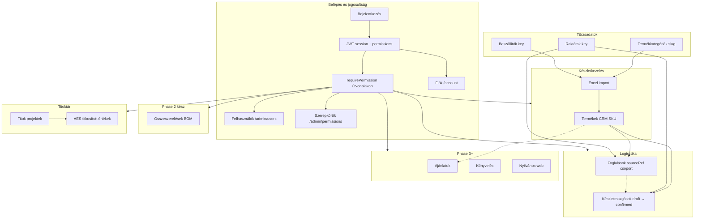
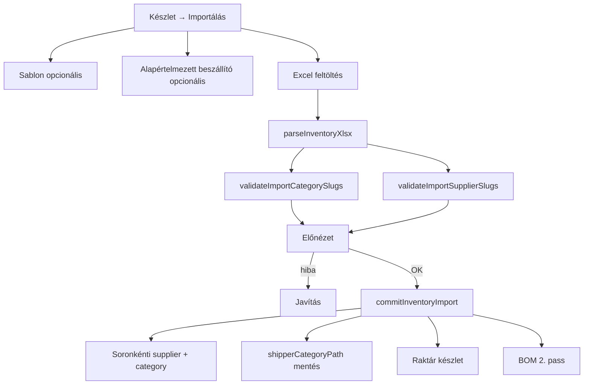
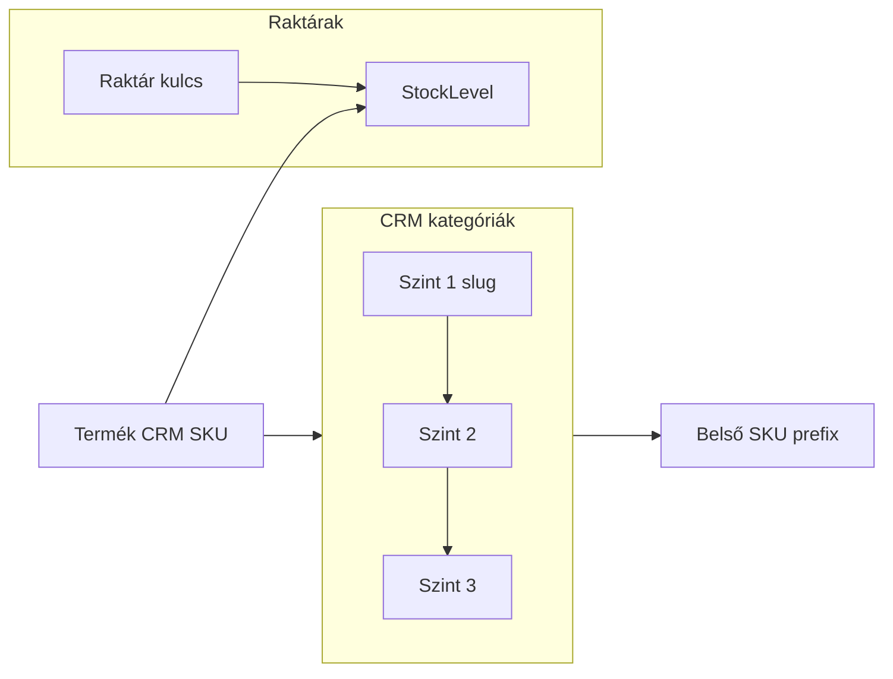
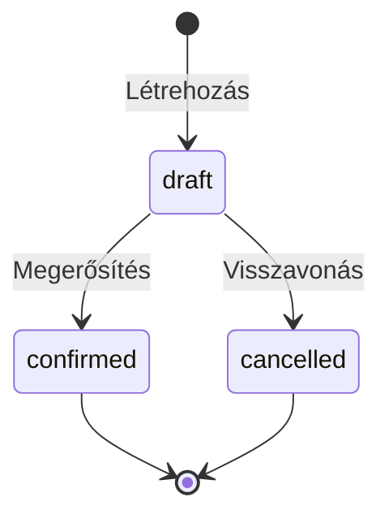
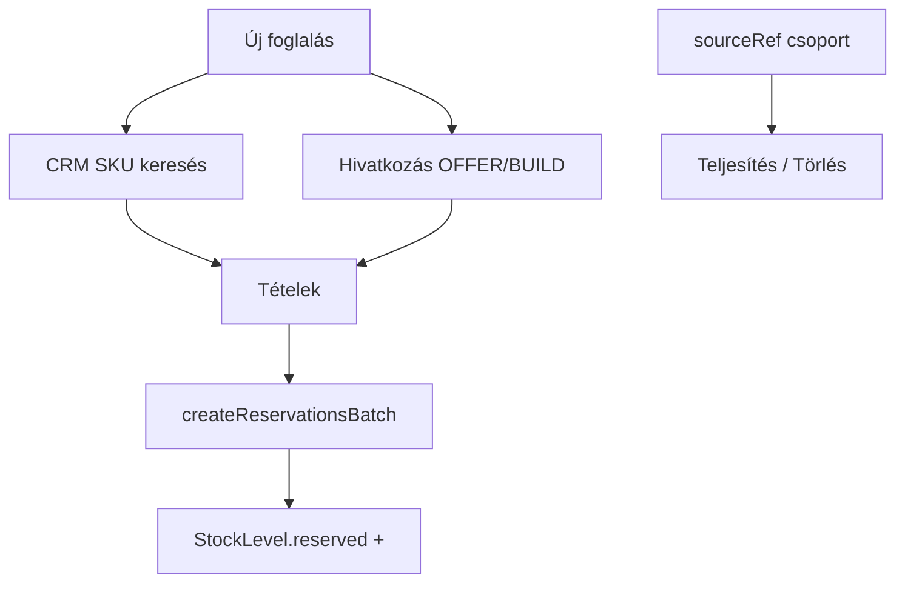
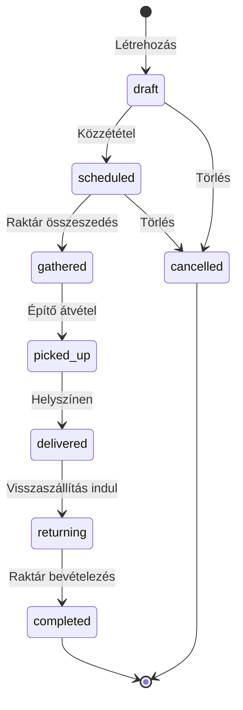
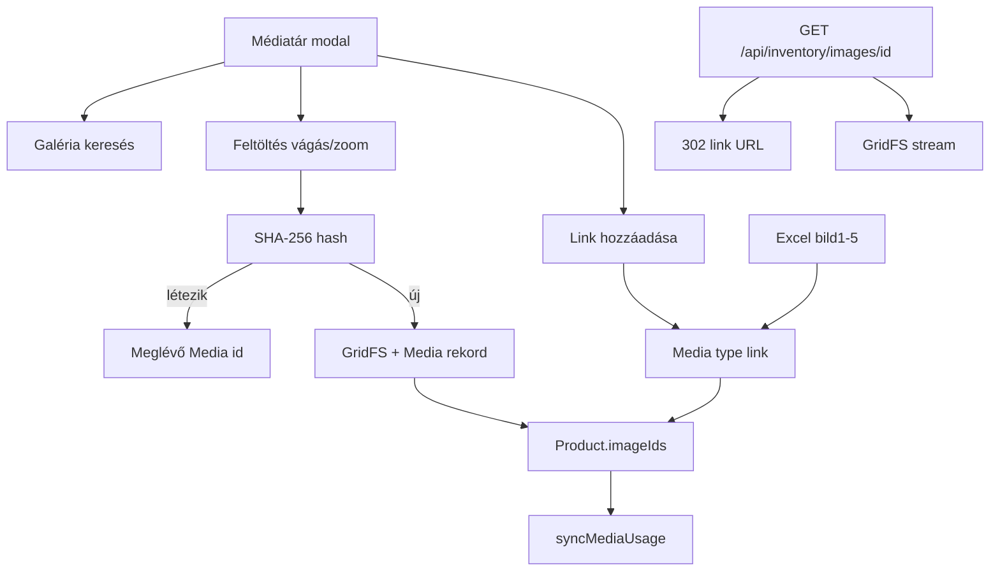
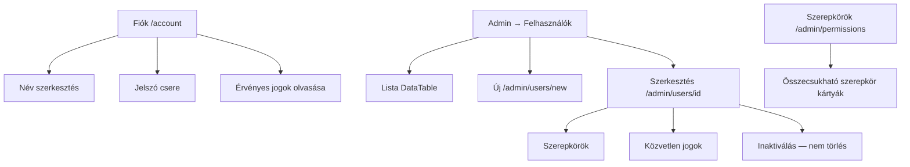

# tCrm — működési folyamatok

> **Karbantartás:** Ezt a fájlt a viselkedést érintő változtatásokkal együtt kell frissíteni (fáziszárás, import, logisztika, navigáció). Részletek: [`ARCHITECTURE.md`](./ARCHITECTURE.md) §9, [`.cursor/rules/flows-documentation.mdc`](../.cursor/rules/flows-documentation.mdc).

## 0. CRM áttekintés (egész rendszer)



| Modul | Útvonalak | Állapot |
|-------|-----------|---------|
| Auth + RBAC | `/login`, `/account`, `/admin/users`, `/admin/permissions` | Phase 0–2 ✓ |
| Készlet | `/inventory`, `/inventory/categories`, `/inventory/builds` | Phase 1–2 ✓ |
| Beszállítók | `/inventory/suppliers` | Phase 2 ✓ |
| Raktárak | `/admin/warehouses` | Phase 2 ✓ |
| Logisztika | `/logistics/*`, `/logistics/jobs`, `/logistics/vehicles` | Phase 2–3 ✓ |
| Termékmenedzsment KPI | `/inventory/dashboard` | Phase 3 ✓ |
| Titoktár | `/secrets`, `/secrets/[id]` | Phase 3 ✓ |
| Ajánlatok | `/offers` | Placeholder (Phase 3) |
| Nyilvános web | `apps/landing` | Phase 3 |

---

## 1. Készlet import (Excel)

### Oszlop- és SKU szótár

| Excel oszlop | MongoDB mező | Jelentés |
|--------------|--------------|----------|
| `product_id` | `Product.supplierSku` | Beszállítói / gyártói cikkszám (Excel kötelező) |
| *(generált)* | `Product.sku` | **CRM SKU** = kategória `skuPrefix` + `product_id` számjegyei |
| `product_id_SM` | *(opcionális)* | Ellenőrzés: ha eltér a generált CRM SKU-tól → figyelmeztetés |
| `crm_category_slug` | `Product.categoryIds[]` | Létező CRM kategória (`Category.slug`) |
| `crm_supplier_slug` | `Product.supplierId` | Beszállító (`Supplier.key`) — soronként; vegyes fájlhoz |
| `crm_warehouse_slug` | `Product.warehouseIds[]` | Raktár (`Warehouse.key`) — vesszővel több; modal alapértelmezett |
| `is_consumable` | `Product.isConsumable` | Üres = tartós (visszavárható); 1/igen = fogyó (nincs hiánykövetés) |
| `cat*Name_*` | `Product.shipperCategoryPath` | Beszállító eredeti kategóriái (nem CRM fa) |
| `warehouse 1.` … | `StockLevel` | Kezdeti készlet |



### Szabályok

| Elem | Kötelező | Megjegyzés |
|------|----------|------------|
| `product_id_SM` | Igen | CRM SKU — egyedi a tCrm-ben |
| `product_id` | Ajánlott | Beszállítói SKU |
| `crm_category_slug` | Igen | Előbb hozza létre: Termékkategóriák |
| `crm_supplier_slug` | Soronként* | `Supplier.key` — vegyes beszállítós fájlhoz |
| Alapértelmezett beszállító | Modal* | Ha a sorban nincs `crm_supplier_slug` |
| `crm_warehouse_slug` | Soronként** | `Warehouse.key` — több: `kispest,erzsebet` |
| Alapértelmezett raktár | Modal** | Ha a sorban nincs `crm_warehouse_slug` |
| Beszállító kategóriák | Opcionális | `cat*Name_*` → `shipperCategoryPath` |

\* Legalább az egyik: sor `crm_supplier_slug` **vagy** modal alapértelmezett minden olyan sorra, ahol üres az oszlop.

\** Ugyanígy a raktárhoz: sor `crm_warehouse_slug` **vagy** modal alapértelmezett raktár.

**Raktár szűrés (UI):** Termékek, összeszerelések, termékmenedzsment — `?warehouseId=` + `logistics:scope_all` / `admin:access` = minden raktár; egyébként csak `Warehouse.assignedUserIds`.

Sablon: `GET /api/inventory/template` · Partnerek: `/inventory/suppliers`

---

## 2. Termékkategóriák és raktárak



---

## 3. Készletmozgások (logisztika)



| Típus | Magyar | Hatás |
|-------|--------|-------|
| `grn` | Bevételezés | + készlet cél raktár |
| `pick` | Kiadás | − készlet forrás |
| `transfer` | Raktárközi | − forrás, + cél |

---

## 4. Foglalások (többsoros)



---

## 5. Esemény szállítások (`LogisticsJob`)

Logisztikai vezető létrehozza a szállítást alkatrészekkel és összeszerelésekkel; raktáros összeszed, építő átvesz és kiszállít, opcionálisan telepít, visszaszállít, raktáros ellenőriz — hiány esemény/helyszín szerint.



| Lépés | Szerepkör | Készlet hatás |
|-------|-----------|---------------|
| Összeszedés megerősítése | Raktár | `pick` mozgás → **− készlet** forrás raktár |
| Átvétel / kiszállítás | Építő | Csak állapot (nincs készletmozgás) |
| Telepítés (opc.) | Építő | `installedQuantity`, `installedLocation` |
| Visszaszállítás | Építő | `returnedQuantity` |
| Bevételezés ellenőrzés | Raktár | `return` mozgás → **+ készlet**; hiány = `gathered − checked` (tartós) |

| Mező / jog | Jelentés |
|------------|----------|
| `LogisticsJob.reference` | `JOB-ÉÉÉÉ-NNNN` (esemény) |
| `LogisticsJob.pickups[]` | Több átvételi kör / eseményenként: raktár, jármű, csapat, tételek |
| `pickup.reference` | `JOB-ÉÉÉÉ-NNNN-P01` — PDF/e-mail hivatkozás |
| `pickup.teamMemberIds[]` | Építőcsapat — kereshető többválasztó, szerepkör szerint csoportosítva |
| `Warehouse.assignedUserIds[]` | Raktári munkatársak (admin raktár szerkesztés); új szállításnál automatikus csapat-javaslat |
| `logistics:scope_all` | Minden raktár szállítása; nélküle csak hozzárendelt raktár(ok) |
| `pickup.contactEmails[]` | Értesítési címek (jövőbeli mail) |
| `pickup.notifications.pendingKinds` | Várakozó értesítések (mail worker) |
| `pickup.notifications.pendingRecipientEmails` | Feloldott címzettek (raktár staff + csapat + contact) |
| `pickup.documents.*` | PDF meta (csomaglista, visszáru) |
| `buildLogisticsPickupDocument` | Sablon JSON PDF generáláshoz |
| Összeszerelés a listán | Prebuild sor összecsukható alkatrészlista (raktár + építő UI, PDF payload) |
| `Vehicle` | Flotta — mm, max súly/térfogat; `suggestVehiclesForCargo` |
| `Product.isConsumable` | Fogyó: nincs `lostQuantity` |
| Útvonalak | `/logistics/jobs`, `/logistics/vehicles`, KPI: `/logistics` |
| Termék KPI | `/inventory/dashboard` — érték, alacsony készlet, BOM |

---

## 6. Összeszerelések (BOM)

Összeszerelés = termék `components` listával. UI: **Készletkezelés → Összeszerelések** (`/inventory/builds`).

`calculateBomAvailability` → **canBuild** = hány db építhető/ajánlható a szabad alkatrészkészletből.

---

## 7. Médiatár (fájl + link)



| Elem | Jelentés |
|------|----------|
| `Media` | Központi meta: `type` file/link, `hash` (fájl), `url` (link), `useCount`, `usages[]` |
| `Product.imageIds` | Media dokumentum id-k (nem nyers GridFS id új feltöltéseknél) |
| `externalImageHints` | Excel/export URL lista; import commit link Media-t is létrehoz |
| `POST /api/uploads` | Hash deduplikáció, Media visszaadás |
| `GET/POST /api/media` | Lista/keresés, link regisztráció |
| `DELETE /api/media/[id]` | Törlés (`media:delete`) |
| Admin | **Adminisztráció → Médiatár** (`/admin/media`) — teljes kezelőfelület |

| Jogosultság | Funkció |
|-------------|---------|
| `media:read` | Médiatár böngészés (vagy `inventory:read`) |
| `media:upload` | Feltöltés, link (vagy `inventory:write`) |
| `media:delete` | Média törlése a könyvtárból |

Termék és összeszerelés űrlap: **Médiatár** gomb → többes kiválasztás, sorrend, eltávolítás.

---

## 8. Készlet táblázat (DataTable)

- **Oszlopok** panel: minden import mező megjeleníthető (`mongoKey` a beágyazott Mongo mezőkhöz); mentés `localStorage` + `tableId`.
- **Kép előnézet** oszlop: opcionális (alapból rejtett) — első Media (`imageIds`) vagy legacy `bild1` URL.
- **Képek (db)** oszlop: `imageIds` vagy `externalImageHints` száma.
- Fejléc **ⓘ** tooltip: Radix; táblázat ikonok egységesen `size-2.5`.

---

## 9. Kereső (`SearchAutocomplete`)

| Használat | Action |
|-----------|--------|
| Termék (CRM SKU / név) | `searchProductsAction` |
| Beszállító | `searchSuppliersAction` |
| Kategória | `searchCategoriesAction` |

---

## 10. Felhasználók és fiók



| Szabály | Részlet |
|---------|---------|
| E-mail | Saját fiókon csak olvasható; admin más felhasználó e-mailjét szerkesztheti |
| Törlés | Nincs — csak `isActive: false` (admin jog) |
| Utolsó admin | Nem inaktiválható, admin szerepkör nem vehető el |
| Saját fiók | Admin nem inaktiválhatja magát |

| Kulcs | Funkció |
|-------|---------|
| `users:read` | Felhasználó lista |
| `users:write` | Létrehozás, szerkesztés, inaktiválás |
| `roles:manage` | Szerepkörök és jogosultságok |

---

## 11. Jogosultságok (összefoglaló)

| Kulcs | Funkció |
|-------|---------|
| `inventory:read` / `write` / `import` | Készlet |
| `suppliers:read` / `manage` | Beszállítók |
| `warehouses:read` / `manage` | Raktárak |
| `logistics:read` / `write` | Szállítások, workflow |
| `logistics:scope_all` | Minden raktár (nem csak `assignedUserIds`) |
| `media:read` / `upload` / `delete` | Központi médiatár |

---

## 12. Beszállító felvétel

Sablon: [`docs/excel/supplier.csv`](./excel/supplier.csv) — cégnév, cím, központi elérhetőség, majd kapcsolatok: ügyvezető, értékesítő, technikai, **mérnök**, **iroda**, raktár, pénzügy (név / mobil / e-mail).

1. **Készletkezelés → Beszállítók** (`/inventory/suppliers`) — olvasás: `suppliers:read` vagy import/write jog; **Új beszállító**: `suppliers:manage` vagy `inventory:import` / `inventory:write`
2. **Kulcs (slug)** → Excel `crm_supplier_slug`
3. **Új termék** (`/inventory/new`) — Excel mezők + beszállító/kategória kereső
4. **Új összeszerelés** (`/inventory/builds/new`) — alkatrész kereső, médiatár (fájl/link), útmutató
5. **Import** a készlet oldalon

---

## 13. Titoktár (secret storage)

Projekt alapú kulcs–érték tárolás (jelszavak, API kulcsok, deployment titkok). Értékek **AES-256-GCM** titkosítással a MongoDB-ben; visszafejtés csak szerveren, **kérésre** (Megjelenítés / Másolás).

```mermaid
flowchart LR
  user[Felhasználó secrets:read]
  list[/secrets lista]
  detail[/secrets/id]
  action[revealSecretValueAction]
  db[(SecretProject)]
  user --> list
  list --> detail
  detail -->|Másolás / szem| action
  action -->|decrypt| user
  detail --> db
```

### Jogosultságok

| Kulcs | Jelentés |
|-------|----------|
| `secrets:read` | Projekt lista + kulcsok; érték on-demand |
| `secrets:write` | Projekt / kulcs létrehozás, szerkesztés |
| `secrets:delete` | Projekt vagy kulcs törlés (létrehozó vagy manage) |
| `secrets:manage` | Minden projekt + megosztás beállítása |

### Megosztás

- **Alapértelmezés: privát** — csak `createdBy`, `secrets:manage`, és explicit `allowedRoles` / `allowedUsers`.
- Megosztás: projekt részletein **Megosztás** (létrehozó vagy `secrets:manage`).

### Környezet

- `SECRETS_ENCRYPTION_KEY` (≥32 karakter), vagy tartalék: `AUTH_SECRET`.

---

*Utolsó frissítés: 2026-05 — **Termék raktár:** `Product.warehouseIds`, `crm_warehouse_slug` import/export, raktár szűrő, raktáros láthatóság.*
