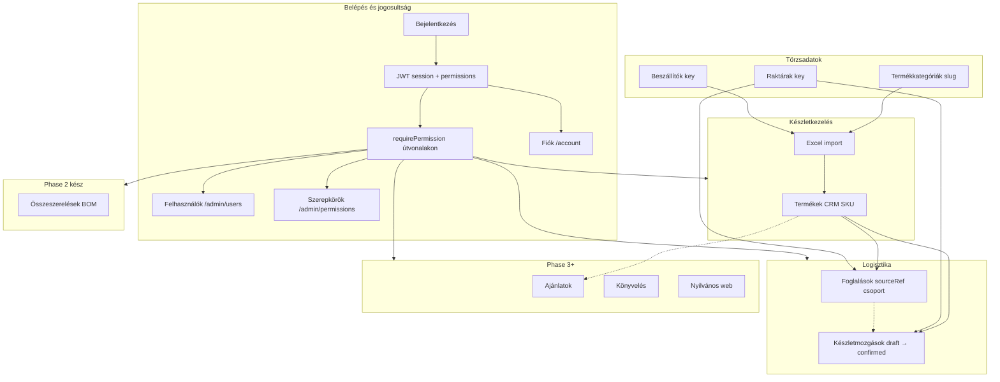
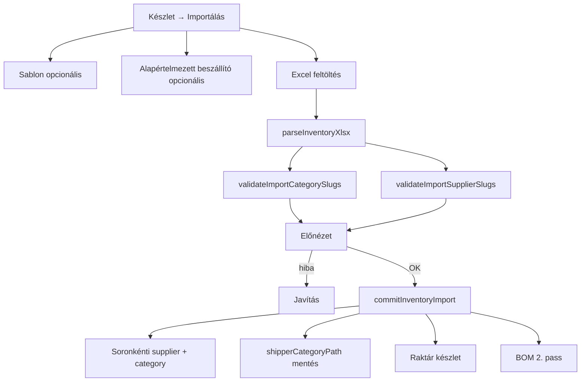
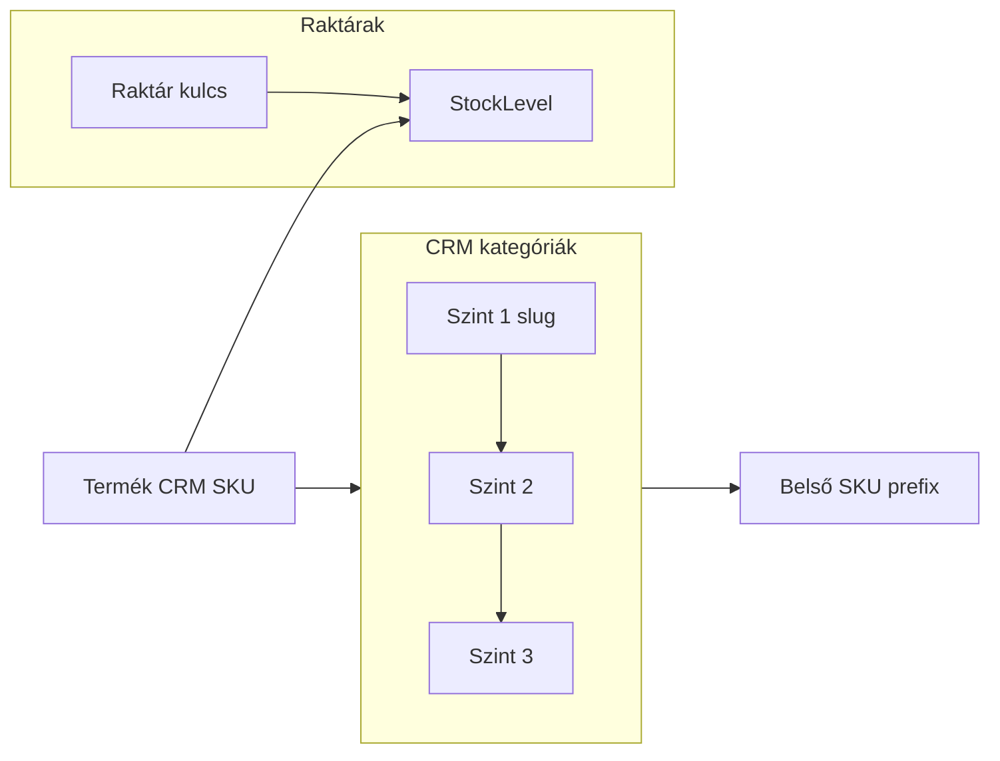
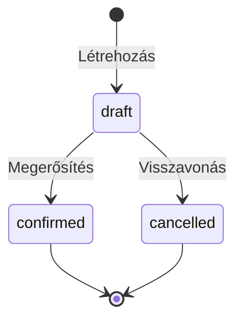
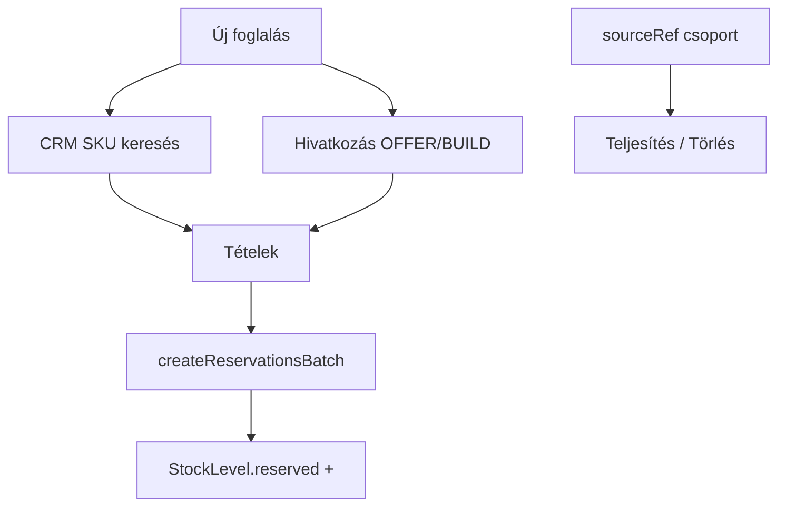
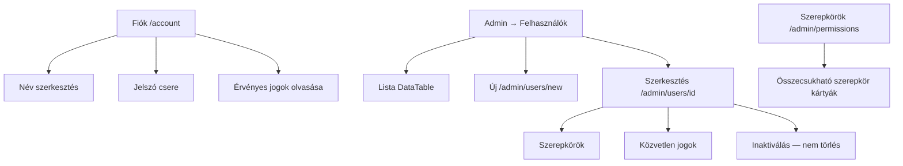

# tCrm — működési folyamatok

> **Karbantartás:** Ezt a fájlt a viselkedést érintő változtatásokkal együtt kell frissíteni (fáziszárás, import, logisztika, navigáció). Részletek: [`ARCHITECTURE.md`](./ARCHITECTURE.md) §9, [`.cursor/rules/flows-documentation.mdc`](../.cursor/rules/flows-documentation.mdc).

## 0. CRM áttekintés (egész rendszer)

| Modul | Útvonalak | Állapot |
|-------|-----------|---------|
| Auth + RBAC | `/login`, `/account`, `/admin/users`, `/admin/permissions` | Phase 0–2 ✓ |
| Készlet | `/inventory`, `/inventory/categories`, `/inventory/builds` | Phase 1–2 ✓ |
| Beszállítók | `/inventory/suppliers` | Phase 2 ✓ |
| Raktárak | `/admin/warehouses` | Phase 2 ✓ |
| Logisztika | `/logistics/*` | Phase 2 ✓ |
| Ajánlatok | `/offers` | Placeholder (Phase 3) |
| Nyilvános web | `apps/landing` | Phase 3 |

---

## 1. Készlet import (Excel)

### Oszlop- és SKU szótár

| Excel oszlop | MongoDB mező | Jelentés |
|--------------|--------------|----------|
| `product_id` | `Product.supplierSku` | Beszállítói / gyártói cikkszám (Excel kötelező) |
| *(generált)* | `Product.sku` | **CRM SKU** = kategória `skuPrefix` + `product_id` számjegyei |
| `product_id_SM` | *(opcionális)* | Ellenőrzés: ha eltér a generált CRM SKU-tól → figyelmeztetés |
| `crm_category_slug` | `Product.categoryIds[]` | Létező CRM kategória (`Category.slug`) |
| `crm_supplier_slug` | `Product.supplierId` | Beszállító (`Supplier.key`) — soronként; vegyes fájlhoz |
| `cat*Name_*` | `Product.shipperCategoryPath` | Beszállító eredeti kategóriái (nem CRM fa) |
| `warehouse 1.` … | `StockLevel` | Kezdeti készlet |

### Szabályok

| Elem | Kötelező | Megjegyzés |
|------|----------|------------|
| `product_id_SM` | Igen | CRM SKU — egyedi a tCrm-ben |
| `product_id` | Ajánlott | Beszállítói SKU |
| `crm_category_slug` | Igen | Előbb hozza létre: Termékkategóriák |
| `crm_supplier_slug` | Soronként* | `Supplier.key` — vegyes beszállítós fájlhoz |
| Alapértelmezett beszállító | Modal* | Ha a sorban nincs `crm_supplier_slug` |
| Beszállító kategóriák | Opcionális | `cat*Name_*` → `shipperCategoryPath` |

\* Legalább az egyik: sor `crm_supplier_slug` **vagy** modal alapértelmezett minden olyan sorra, ahol üres az oszlop.

Sablon: `GET /api/inventory/template` · Partnerek: `/inventory/suppliers`

---

## 2. Termékkategóriák és raktárak

---

## 3. Készletmozgások (logisztika)

| Típus | Magyar | Hatás |
|-------|--------|-------|
| `grn` | Bevételezés | + készlet cél raktár |
| `pick` | Kiadás | − készlet forrás |
| `transfer` | Raktárközi | − forrás, + cél |

---

## 4. Foglalások (többsoros)

---

## 5. Összeszerelések (BOM)

Összeszerelés = termék `components` listával. UI: **Készletkezelés → Összeszerelések** (`/inventory/builds`).

`calculateBomAvailability` → **canBuild** = hány db építhető/ajánlható a szabad alkatrészkészletből.

---

## 6. Készlet táblázat (DataTable)

- **Oszlopok** panel: minden import mező megjeleníthető (`mongoKey` a beágyazott Mongo mezőkhöz); mentés `localStorage` + `tableId`.
- **Kép előnézet** oszlop: opcionális (alapból rejtett) — első GridFS vagy `bild1` URL.
- **Képek (db)** oszlop: Excel `bild1`–`bild5` / `externalImageHints` és feltöltött `imageIds` száma (max érték).
- Fejléc **ⓘ** tooltip: Radix; táblázat ikonok egységesen `size-2.5`.

---

## 7. Kereső (`SearchAutocomplete`)

| Használat | Action |
|-----------|--------|
| Termék (CRM SKU / név) | `searchProductsAction` |
| Beszállító | `searchSuppliersAction` |
| Kategória | `searchCategoriesAction` |

---

## 8. Felhasználók és fiók

| Szabály | Részlet |
|---------|---------|
| E-mail | Saját fiókon csak olvasható; admin más felhasználó e-mailjét szerkesztheti |
| Törlés | Nincs — csak `isActive: false` (admin jog) |
| Utolsó admin | Nem inaktiválható, admin szerepkör nem vehető el |
| Saját fiók | Admin nem inaktiválhatja magát |

| Kulcs | Funkció |
|-------|---------|
| `users:read` | Felhasználó lista |
| `users:write` | Létrehozás, szerkesztés, inaktiválás |
| `roles:manage` | Szerepkörök és jogosultságok |

---

## 9. Jogosultságok (összefoglaló)

| Kulcs | Funkció |
|-------|---------|
| `inventory:read` / `write` / `import` | Készlet |
| `suppliers:read` / `manage` | Beszállítók |
| `warehouses:read` / `manage` | Raktárak |
| `logistics:read` / `write` | Mozgások, foglalások |

---

## 10. Beszállító felvétel

1. **Készletkezelés → Beszállítók** (`/inventory/suppliers`) — `suppliers:read`, `suppliers:manage`, `inventory:import` vagy `inventory:write`
2. **Kulcs (slug)** → Excel `crm_supplier_slug`
3. **Termékkategóriák** → Excel `crm_category_slug`
4. **Import** a készlet oldalon

---

*Utolsó frissítés: 2026-05 — **Phase 2 zárás:** logisztika, felhasználók/fiók, DataTable oszlopkezelés + opcionális kép oszlopok, beszállítók, raktárak.*
