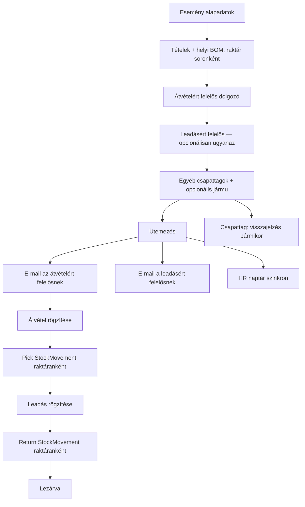

# Logistics (Phase 2)

Stock movements, reservations, event shipments (jobs/pickups), and vehicle fleet.

**Package:** `@crm/logistics`  
**Models:** `Reservation`, `StockMovement`, `LogisticsJob`, `Vehicle`, `VehicleIncident` in `@crm/db-core`

## Permissions

| Key | Use |
|-----|-----|
| `logistics:read` | Overview, movements, reservations, jobs |
| `logistics:write` | Create/confirm movements, reservations, jobs |
| `logistics:scope_all` | All warehouses (not only `Warehouse.assignedUserIds`) |
| `logistics:vehicles:read` | Fleet list/detail without ops access |
| `logistics:vehicles:report` | Incident reports + photos |

Register: `logisticsPermissions` in `apps/crm/src/lib/rbac-bootstrap.ts`. After deploy, run **Baseline jogosultságok szinkronizálása** on `/admin/permissions` so `admin` receives the new keys.

## Routes

| Path | Purpose |
|------|---------|
| `/logistics` | KPI overview |
| `/logistics/movements` | GRN / pick / transfer list |
| `/logistics/movements/new/{grn,pick,transfer}` | Create draft movement |
| `/logistics/movements/[id]` | Confirm / cancel |
| `/logistics/reservations` | Hold stock |
| `/logistics/jobs` | Event shipments |
| `/logistics/jobs/new` | Create wizard: event detail → parts (job-local BOM, per-line warehouse) → employees |
| `/logistics/jobs/[id]` | Team assignment, schedule/cancel, pickup check-in, return check-in, feedback |
| `/logistics/vehicles` | Fleet |
| `/logistics/vehicles/[id]` | Vehicle detail, documents, incidents |
| `/inventory/builds` | BOM kits (inventory write) |

## Job flow

## Notes

- **Very simple, deliberately.** This module replaced a much larger demand-planning engine
  (multi-round pickup optimizer, vehicle-capacity fitting, 5-role crew, item-request approvals) —
  see [`logistics-jobs-legacy.md`](./logistics-jobs-legacy.md) for what existed before and why it
  was cut down.
- `LogisticsJob` has one **pickup-responsible employee** and one **drop-off-responsible employee**
  (`pickupEmployeeId`/`dropoffEmployeeId` — can be the same person; drop-off falls back to the
  pickup person when unset), plus a flat `crewEmployeeIds[]` list with read + feedback access
  only. There are no crew roles beyond these three.
- Job-local kits (`demandLines[].kit`) override catalog BOMs **for that job only** —
  `Product.components` is never written back. This is the one piece of the old planning engine
  that was kept as-is (`explodeDemandLines` in `demand-explode.ts`).
- Warehouse is chosen **per demand line** (`demandLines[].warehouseId`), not per job — a job's
  parts can come from different warehouses. On schedule, `scheduleLogisticsJob` explodes
  `demandLines` into physical `lines[]` and requires every line to have a warehouse.
- No planning/optimizer/reservation step: `scheduleLogisticsJob` sends the assignment emails and
  syncs HR directly. Stock only moves at the two check-in steps —
  `confirmPickupCheckIn` creates one `pick` `StockMovement` per distinct source warehouse,
  `confirmReturnCheckIn` creates one `return` `StockMovement` per distinct destination warehouse
  (defaults to the pickup warehouse, editable at return time). `Reservation`/`VehicleBooking`
  soft-holds are not used by jobs any more.
- If the pickup person had a problem (wrong quantity, substitution), they just enter what they
  actually gathered and add a free-text note — there's no separate BOM-editing UI mid-check-in.
  Logistics can edit the demand list itself (`updateJobDemand`) while the job is still `draft`.
- `vehicleId` on a job is a plain optional reference into the `Vehicle` fleet — no
  booking/time-window/capacity-fitting engine.
- Access: `logistics:write` sees/edits everything; anyone whose `Employee` membership matches
  `pickupEmployeeId`, `dropoffEmployeeId`, or is in `crewEmployeeIds` can view the job, do their
  check-in step, and leave feedback — no `logistics:read` permission required for that.
- HR calendar sync (`syncLogisticsJobToEmployeeSchedules`) upserts one `ScheduleEntry` per
  employee per job (`sourceRef.refType: 'job'`, `role: 'pickup'|'dropoff'|'crew'`) — no more
  per-pickup-round fan-out.
- Assignment emails (`job_pickup_assigned`, `job_dropoff_assigned`) embed the parts list as an
  HTML table directly in the email body — there is no PDF pipeline.
- Job statuses: `draft → scheduled → picked_up → completed`, or `cancelled` (only from `draft`/`scheduled`).

*Last updated: 2026-08-24 — simplified rebuild.*
