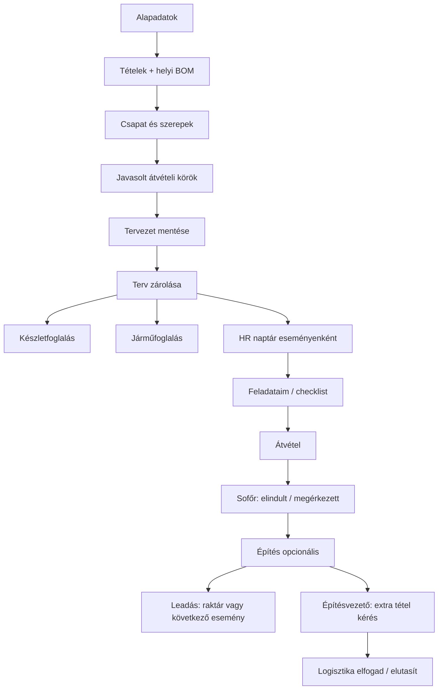

# Logistics (Phase 2)

Stock movements, reservations, event shipments (jobs/pickups), and vehicle fleet.

**Package:** `@crm/logistics`  
**Models:** `Reservation`, `StockMovement`, `LogisticsJob`, `Vehicle`, `VehicleIncident` in `@crm/db-core`

## Permissions

| Key | Use |
|-----|-----|
| `logistics:read` | Overview, movements, reservations, jobs |
| `logistics:write` | Create/confirm movements, reservations, jobs |
| `logistics:scope_all` | All warehouses (not only `Warehouse.assignedUserIds`) |
| `logistics:vehicles:read` | Fleet list/detail without ops access |
| `logistics:vehicles:report` | Incident reports + photos |

Register: `logisticsPermissions` in `apps/crm/src/lib/rbac-bootstrap.ts`. After deploy, run **Baseline jogosultságok szinkronizálása** on `/admin/permissions` so `admin` receives the new keys.

## Routes

| Path | Purpose |
|------|---------|
| `/logistics` | KPI overview |
| `/logistics/movements` | GRN / pick / transfer list |
| `/logistics/movements/new/{grn,pick,transfer}` | Create draft movement |
| `/logistics/movements/[id]` | Confirm / cancel |
| `/logistics/reservations` | Hold stock |
| `/logistics/jobs` | Event shipments |
| `/logistics/jobs/new` | Demand wizard: details → parts (job-local BOM) → crew → pickup rounds |
| `/logistics/jobs/[id]` | Plan (propose/lock), director requests, pickup checklists |
| `/logistics/vehicles` | Fleet |
| `/logistics/vehicles/[id]` | Vehicle detail, documents, incidents |
| `/inventory/builds` | BOM kits (inventory write) |

## Job plan flow

## Notes

- Jobs are **demand-first**: logistics writes an item list; `previewPickupPlan` / `proposeJobPlan` splits by warehouse stock and free vehicles; `lockJobPlan` reserves stock (`Reservation` sourceType `event`), books vehicles (`VehicleBooking`), and syncs HR.
- Job-local kits (`demandLines[].kit`) override catalog BOMs **for that job only** — `Product.components` is never written back. Explosion uses kit components when present.
- Crew roles (`director`, `pickup`, `driver`, `builder`, `dropoff`) live on `LogisticsJob.crew`. Pickup/drop-off people confirm PICK/RETURN — there is no warehouse-keeper role. The HR calendar merges those roles into **one block per employee per job**, labeled with the event name.
- Check-in (leadás) can return stock to **any warehouse**, not only the pickup origin, or **hand off** quantities to another open job (no warehouse GRN; the next job skips warehouse pick for that qty).
- Warehouse-scoped users see jobs whose pickups are in assigned warehouses **or** they are on `crew`. Field checklists work for assigned people without `hr:self` (any of their company memberships).
- Job status emails use `@crm/mail` templates (`job_scheduled`, `pickup_gathered`, …). Seeded at `/setup` and once per process on dashboard load.
- Vehicle bookings are time windows (no GPS). Last-known place is warehouse / site / unknown.
- Offers (`/offers`) are not in this phase.

*Last updated: 2026-08.*
